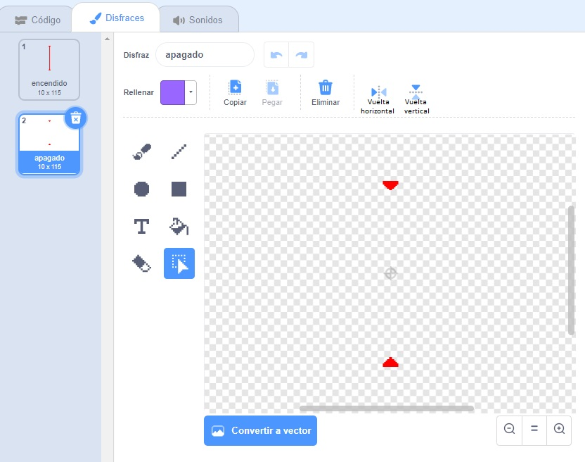

## ¡Láseres!

¡Vamos a añadir láseres para que tu juego sea un poco más difícil!

--- task ---

Agrega un nuevo objeto a tu juego y llámalo `láser`. Debe tener dos disfraces: uno llamado 'encendido' y otro llamado 'apagado'.




--- /task ---

--- task ---

Coloca tu nuevo objeto láser entre dos plataformas.


--- /task ---

--- task ---

Añade un código a tu objeto láser para que intercambie sus dos disfraces.


```blocks3
    when flag clicked
    forever
        switch costume to (encendido v)
        wait (2) seconds
        switch costume to (apagado v)
        wait (2) seconds
    end
```

Si lo prefieres, puedes cambiar el código que se muestra arriba para que el objeto `espere`{:class="block3control"} un determinado tiempo `aleatorio`{:class="block3operators"} entre los cambios de disfraz.

--- /task ---

--- task ---

Finalmente, añade un código a tu objeto láser para que emita el mensaje "golpeado" cuando vez que toque al objeto personaje.

--- hints ---


--- hint ---

Este código debe ser muy parecido al código que añadiste a tu objeto pelota.

--- /hint ---

--- hint ---

Copia el código que añadiste a la pelota para hacer que el objeto `envíe` el mensaje `'golpeado'`{:class="block3control"} cuando `toca a tu personaje`{:class="block3sensing"}.

--- /hint ---

--- hint ---

Este es el código que debes incluir:


```blocks3
when green flag clicked
forever 
  if <touching (Pico walking v) ?> then 
    broadcast (golpeado v)
  end
end
```

--- /hint ---

--- /hints ---

No tienes que añadir ningún código adicional al objeto personaje porque ¡ya sabe qué hacer cuando recibe el mensaje `'golpeado'`{:class="block3control"}!

--- /task ---

--- task ---

Prueba tu juego para ver si puedes mover al personaje más allá del láser. Si el láser es demasiado fácil o difícil de evitar, cambia el tiempo de `espera`{:class="block3control"} en el código del objeto láser.

--- /task ---