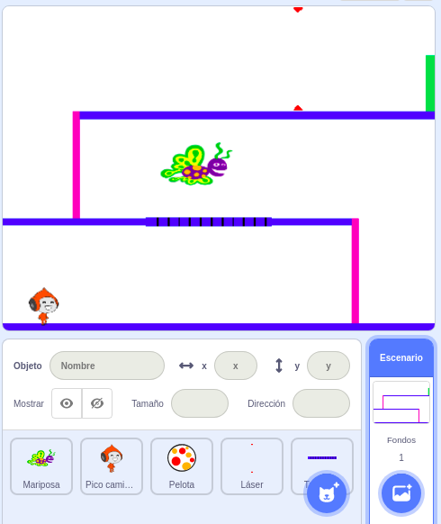

## Desafío: Más obstáculos

Si crees que tu juego es demasiado fácil puedes poner más obstáculos. ¡Los obstáculos pueden ser lo que quieras! Aquí tienes algunas ideas:

+ Una mariposa peligrosa
+ Plataformas que aparecen y desaparecen
+ Pelotas de tenis cayendo que deben esquivarse



Incluso podrías diseñar otro fondo para crear el siguiente nivel. Después añade un código para que cuando tu personaje llegue a la puerta verde, el juego cambie al nuevo fondo:


```blocks3
    if <touching color [#00FF00]?> then
        switch backdrop to (next backdrop v)
        go to x: (-210) y: (-120)
        wait (1) seconds
    end
```