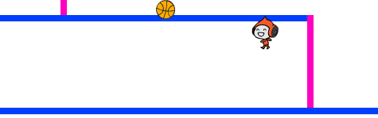

\--- challenge \---

## Challenge: Improved gravity

There's one other small bug in your game: gravity doesn't pull your character downwards if *any* part of it is touching a blue platform - even its head! You can test this out by climbing most of the way up a ladder and then moving to the left.



Can you fix this bug? To do this, you need to give your character different coloured trousers (on *all* costumes)...


...and then replace the code:

```blocks
    < touching color [#0000FF]? >
```

with:

```blocks
    < color [#00FF00] is touching [#0000FF]? >
```

Remember to test your improvements to make sure you've fixed the bug!

\--- /challenge \---