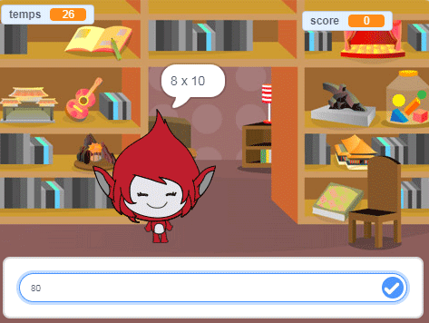

## Et ensuite ?

Essaie notre projet [Jeu d'ingéniosité](https://projects.raspberrypi.org/fr-FR/projects/brain-game?utm_source=pathway&utm_medium=whatnext&utm_campaign=projects) , dans lequel tu peux créer ton propre quiz mathématique.

--- no-print ---

Clique sur le bouton pour démarrer. Tape la réponse à la question, puis appuie sur la touche <kbd>Entrée</kbd>.

  <iframe allowtransparency="true" width="485" height="402" src="https://scratch.mit.edu/projects/embed/350711225/?autostart=false" frameborder="0" scrolling="no"></iframe>
  

--- /no-print ---

--- print-only ---

--- /print-only ---

***

Ce projet a été traduit par des bénévoles:

Jonathan Vannieuwkerke
Michel Arnols

Grâce aux bénévoles, nous pouvons donner aux gens du monde entier la chance d'apprendre dans leur propre langue. Vous pouvez nous aider à atteindre plus de personnes en vous portant volontaire pour la traduction - plus d'informations sur [rpf.io/translate](https://rpf.io/translate).