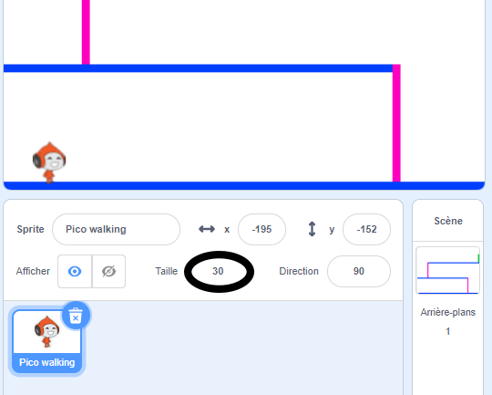

## Mouvement du personnage

Commence par créer un personnage qui peut se déplacer à gauche et à droite, et qui peut gravir des échelles.

--- task ---

Ouvre le projet de démarrage Scratch « La balle au prisonnier ».

**En ligne :** ouvre le projet de démarrage à [rpf.io/dodgeball-on](http://rpf.io/dodgeball-on){:target="_ blank"}.

Si tu as un compte Scratch, tu peux en créer une copie en cliquant sur **Remix**.

**Hors-ligne :** télécharge le projet de démarrage à partir de [rpf.io/p/fr-FR/dodgeball-get](http://rpf.io/p/fr-FR/dodgeball-get) , puis ouvre-le à l'aide de l'éditeur hors-ligne.

--- /task ---

Le projet contient un fond avec des plateformes :


--- task ---

Choisis un nouveau sprite en tant que personnage que le joueur contrôlera et ajoute-le à ton projet. Il est préférable que tu choisisses un sprite avec plusieurs costumes, afin de lui donner l’impression de marcher.


[[[generic-scratch3-sprite-from-library]]]

--- /task ---

--- task ---

Ajoute des blocs de code à ton sprite afin que le joueur puisse utiliser les touches fléchées pour déplacer le personnage. Lorsque le joueur appuie sur la flèche de droite, le personnage doit se diriger vers la droite, faire quelques pas et passer au costume suivant :


```blocks3
when flag clicked
forever
	if <key (right arrow v) pressed? > then
		point in direction (90 v)
		move (3) steps
		next costume
	end
end
```

--- /task ---

--- task ---

Si ton sprite ne correspond pas, ajuste sa taille.



--- /task ---

--- task ---

Teste ton personnage en cliquant sur le drapeau, puis en maintenant enfoncée la touche fléchée droite. Ton personnage se déplace-t-il vers la droite ? Ton personnage a-t-il l'air de marcher ?


--- /task ---

--- task ---

Ajoute des blocs de code à la boucle du sprite `répéter indéfiniment`{:class="block3control"} du personnage de sorte qu'il se déplace vers la gauche si tu appuies sur la touche fléchée gauche.

--- hints ---


--- hint ---

Pour que ton personnage puisse se déplacer vers la gauche, tu dois ajouter un autre bloc `si`{:class="block3control"} à l'intérieur de la boucle `répéter indéfiniment`{:class="block3control"}. Dans ce nouveau bloc `si`{:class="block3control"}, ajoute du code pour que ton sprite de personnage `se déplace`{:class="block3motion"} vers la gauche.

--- /hint ---

--- hint ---

Copie le code que tu as créé pour faire marcher le personnage à droite. Définis ensuite la `touche pressée`{:class="block3sensing"} sur la `flèche gauche`{:class="block3sensing"}, puis modifie la `direction`{:class="block3motion"} à `-90`.

```blocks3
if <key (right arrow v) pressed? > then
	point in direction (90 v)
	move (3) steps
	next costume
end
```

--- /hint ---

--- hint ---

Ton code devrait ressembler à ceci :


```blocks3
when green flag clicked
forever 
  if <key (right arrow v) pressed?> then 
    point in direction (90 v)
    move (3) steps
    next costume
  end
  if <key (left arrow v) pressed?> then 
    point in direction (-90 v)
    move (3) steps
    next costume
  end
end
```

--- /hint ---

--- /hints ---

--- /task ---

--- task ---

Teste ton nouveau code pour t'assurer qu'il fonctionne. Ton personnage se retourne-t-il en marchant vers la gauche ?


Si c'est le cas, tu peux résoudre ce problème en cliquant sur la **direction** de ton sprite de personnage, puis en cliquant sur la flèche gauche-droite.


Ou si tu préfères, tu peux également résoudre le problème en ajoutant ce bloc au début du script de ton personnage :

```blocks3
set rotation style [left-right v]
```

--- /task ---

--- task ---

Pour gravir une échelle rose, le sprite de ton personnage doit faire quelques pas vers le haut sur la scène chaque fois que tu appuies sur la flèche du haut **et** que le personnage touche la bonne couleur.

Ajoute à l'intérieur de la boucle du personnage `répéter indéfiniment`{:class="block3control"} pour `changer`{:class="block3motion"} la position (verticales) `y` du personnage `si`{:class="block3control"} la `flèche du haut est pressée`{:class="block3sensing"} et le personnage `touche la couleur rose`{:class="block3sensing"}.


```blocks3
	if < <key (up arrow v) pressed?> and <touching color [#FF69B4]?> > then
		change y by (4)
	end
```

--- /task ---

--- task ---

Teste ton code. Peux-tu faire grimper le personnage sur les échelles roses et atteindre la fin du niveau ?


--- /task ---