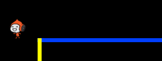
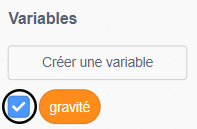

## Gravité et saut

Vous allez maintenant faire bouger votre personnage de façon plus réaliste: vous allez ajouter de la gravité à votre jeu et lui donner la possibilité de sauter.

\--- task \---

Dans le jeu, déplacez votre personnage pour qu’il sorte d’une plate-forme. Voyez-vous qu'il peut marcher dans un espace vide?



\--- /task \---

\--- task \---

Pour résoudre ce problème, ajoutez de la gravité à votre jeu. Pour ce faire, créez une nouvelle variable appelée `gravity`{: class = "block3variables"}.

[[[generic-scratch3-add-variable]]]

Vous pouvez masquer cette variable de votre scène si vous le souhaitez.



\--- /task \---

\--- task \---

Ajoutez ces nouveaux blocs de code qui définissent `gravité` sur un nombre négatif et utilisez la valeur `gravité` pour modifier de manière répétée les coordonnées y de votre personnage:


```blocks3
    Lorsque le drapeau a cliqué sur
    réglez [gravité v] sur [-4]
    pour toujours
        changez y par (gravité)
    end
```

\--- /task \---

\--- task \---

Cliquez sur le drapeau, puis faites glisser votre personnage vers le haut de la scène. Ce qui se produit? La gravité fonctionne-t-elle comme prévu?


\--- /task \---

\--- task \---

La gravité ne devrait pas déplacer le personnage du personnage à travers une plate-forme ou une échelle! Ajoutez un bloc `si`{: class = "block3control"} à votre code pour que la gravité ne fonctionne que lorsque le personnage est en plein vol. Le code de gravité devrait alors ressembler à ceci:


```blocks3
    lorsque le drapeau a cliqué sur
    réglez [gravité v] sur [-4]
    pour toujours
        si < pas < <touching color [#0000FF]?> ou <touching color [#FF69B4]?> > > puis
            changez y par (gravité)
        fin
    fin
```

\--- /task \---

\--- task \---

Testez à nouveau le jeu pour voir si la gravité fonctionne correctement maintenant. Votre personnage de sprite cesse-t-il de tomber lorsqu'il touche une plate-forme ou une échelle? Pouvez-vous obliger le personnage à sortir du bord des plates-formes et à tomber au niveau inférieur?


\--- /task \---

\--- task \---

Ajoutez maintenant du code pour que votre personnage saute chaque fois que le joueur appuie sur la touche <kbd>espace</kbd>. Un moyen très simple de faire cela est de déplacer votre personnage plusieurs fois:


```blocks3
    lorsque la touche [espace v] est enfoncée
    répétition (10)
        modifie y par (4)
    fin
```

Comme la gravité pèse constamment sur votre personnage de 4 pixels, vous devez choisir un nombre supérieur à `4` dans votre bloc `changements y de (4)`{: class = "block3motion"}. Changez le nombre jusqu'à ce que vous soyez satisfait de la hauteur à laquelle le personnage saute.

\--- /task \---

\--- task \---

Testez votre code. Notez que le mouvement de saut n'est pas très lisse. Pour rendre le saut plus fluide, vous devez déplacer votre sprite de personnage de plus en plus petit, jusqu'à ce qu'il n'augmente plus.

\--- /task \---

\--- task \---

Pour ce faire, créez une nouvelle variable appelée `saut hauteur`{: class = "block3variables"}. Encore une fois, vous pouvez masquer cette variable si vous préférez.

\--- /task \---

\--- task \---

Supprimez le code de saut que vous avez ajouté à l'image-objet de votre personnage et ajoutez ce code à la place:


```blocks3
    lorsque la touche [espace v] est enfoncée
    réglez [hauteur du saut v] sur [8]
    répétez jusqu'à ce que < (hauteur du saut) = [0] >
        modifie y par (hauteur du saut)
        modifie [hauteur du saut v] de (-0,5)
    fin
```

Ce code déplace votre personnage de 8 pixels, puis de 7,5 pixels, puis de 7 pixels, et ainsi de suite, jusqu'à ce qu'il ne monte plus. Cela rend le saut plus lisse.

\--- /task \---

\--- task \---

Modifiez la valeur du `hauteur de saut`{: class = "block3variables"} variable définie avant que les `répétitions`{: class = "block3control"} commence. Puis testez votre jeu.

Répétez ces deux étapes jusqu'à ce que vous soyez satisfait de la hauteur du personnage.

\--- /task \---