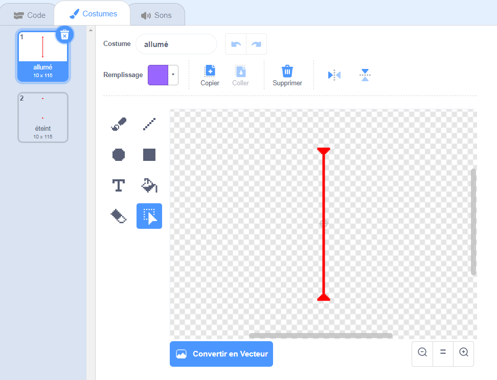

## Lasers !

Pour que ton jeu soit un peu plus difficile à terminer, tu vas ajouter des lasers !

--- task ---

Ajoute un nouveau sprite à ton jeu et appelle-le `laser`. Il devrait avoir deux costumes: l'un appelé « allumé » et l'autre appelé « éteint ».




--- /task ---

--- task ---

Place ton nouveau sprite laser entre deux plates-formes.


--- /task ---

--- task ---

Ajoute du code à ton sprite laser pour le faire basculer entre ses deux costumes.


```blocks3
	when flag clicked
	forever
		switch costume to (on v)
		wait (2) seconds
		switch costume to (off v)
		wait (2) seconds
	end
```

Si tu préfères, tu peux modifier le code présenté ci-dessus de sorte que le sprite `attend`{:class="block3control"} une durée `aléatoire`{:class="block3operators"} entre les changements de costume.

--- /task ---

--- task ---

Enfin, ajoute du code à ton sprite laser afin que le sprite laser diffuse un message « touché » lorsqu'il touche le sprite du personnage.

--- hints ---


--- hint ---

Ce code doit être très similaire au code que tu as ajouté à ton sprite de balle.

--- /hint ---

--- hint ---

Copie le code que tu as ajouté au sprite de balle pour que ce sprite `envoie à tous « touché »`{:class="block3control"} lorsqu'il touche `ton personnage`{:class="block3sensing"}.

--- /hint ---

--- hint ---

Voici le code que tu dois ajouter :


```blocks3
when green flag clicked
forever 
  if <touching (Pico walking v) ?> then 
    broadcast (touché v)
  end
end
```

--- /hint ---

--- /hints ---

Tu n'as pas besoin d'ajouter de code supplémentaire au sprite de ton personnage, car celui-ci sait déjà quoi faire lorsqu'il reçoit le `envoyer à tous « touché »`{:class="block3control"} !

--- /task ---

--- task ---

Teste ton jeu pour voir si tu peux déplacer le personnage au-delà du laser. Si le laser est trop facile ou trop difficile à éviter, change les temps `d'attente`{:class="block3control"} dans le code du sprite laser.

--- /task ---