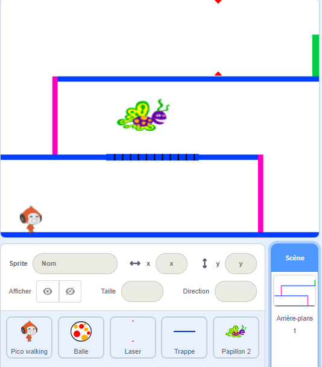

## Défi : plus d'obstacles

Si tu penses que ton jeu est encore trop facile, tu peux lui ajouter plus d'obstacles. Les obstacles peuvent être tout ce que tu veux ! Voici quelques idées :

+ Un papillon dangereux
+ Des plateformes qui apparaissent et disparaissent
+ Chutes de balles de tennis à éviter



Tu peux même concevoir un autre fond pour créer le niveau suivant. Ajoute ensuite du code pour que, lorsque ton personnage atteint la porte verte, le jeu bascule vers le nouvel arrière-plan :


```blocks3
	if <touching color [#00FF00]?> then
		switch backdrop to (next backdrop v)
		go to x: (-210) y: (-120)
		wait (1) seconds
	end
```