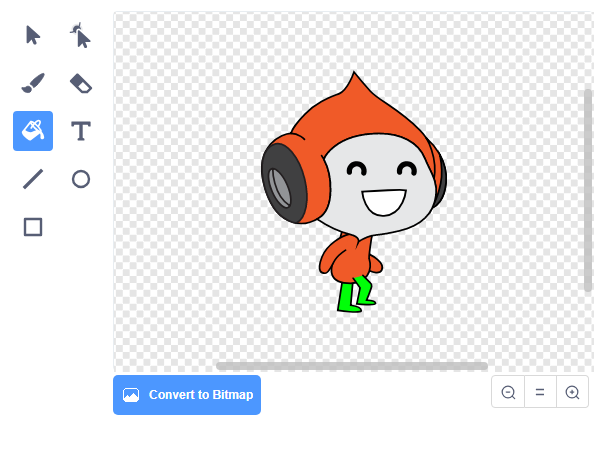

## चुनौती: गुरुत्वाकर्षण में सुधार

आपके खेल में एक और छोटी समस्या है: गुरुत्वाकर्षण पात्र sprite को नीचे की ओर नहीं खींचता है यदि sprite का **कोई** हिस्सा एक नीले रंग के प्लेटफार्म को छू रहा है। यहां तक कि अगर sprite का सिर भी एक प्लेटफार्म को छूता है, तो sprite गिरता नहीं है! आप स्वयं इसका परीक्षण कर सकते हैं: अपने पात्र को सीढ़ी के ऊपर की ओर चढ़ने दें, और फिर एक प्लेटफ़ॉर्म के नीचे पात्र को बग़ल में ले जाएँ:


इस समस्या को ठीक करने के लिए, आपको सबसे पहले अपने पात्र sprite को नए पतलून देने की आवश्यकता होगी जिसमें एक अलग रंग होता है (**सभी** costumes पर)।



फिर इस कोड खंड को बदलें:

```blocks3
    < touching color [#0000FF]? >
```

इस कोड खंड के साथ:

```blocks3
    < color [#00FF00] is touching [#0000FF]? >
```

यह सुनिश्चित करने के लिए कि आपने समस्या को हल कर लिया है, इन परिवर्तनों को करने के बाद गेम का परीक्षण करें!