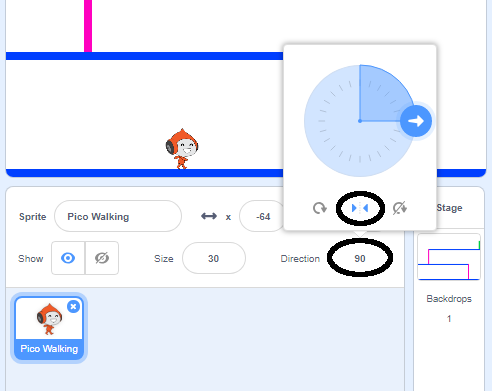

## पात्र की गति

एक ऐसा पात्र बनाकर शुरू करें जो बाएँ और दाएँ घूम सकता है, और सीढ़ी चढ़ सकता है।

--- task ---

'Dodgeball' Scratch प्रारंभक परियोजना खोलें।

**ऑनलाइन:** [rpf.io/dodgeball-on](http://rpf.io/dodgeball-on){:target="_blank"} पर प्रारंभक परियोजना खोलें।

यदि आपके पास एक Scratch खाता है, तो आप **Remix** पर क्लिक करके प्रतिलिपि बना सकते हैं।

**ऑफ़लाइन:** प्रारंभक परियोजना को [rpf.io/p/hi-IN/dodgeball-get](http://rpf.io/p/hi-IN/dodgeball-get) से डाउनलोड करें और फिर इसे ऑफ़लाइन संपादक का उपयोग करके खोलें।

--- /task ---

इस परियोजना में प्लेटफार्मों के साथ एक पृष्ठभूमि शामिल है:


--- task ---

एक नया sprite चुनें पात्र के रूप में जिसे खिलाड़ी नियंत्रित करेगा, और इसे अपनी परियोजना में जोड़ें। सबसे अच्छा होगा अगर आप कई costumes वाले sprite को चुनते हैं, ताकि आप इसे ऐसा दिखा सकें जैसे कि यह चल रहा है।


[[[generic-scratch3-sprite-from-library]]]

--- /task ---

--- task ---

अपने पात्र sprite में कोड खंड जोड़ें ताकि खिलाड़ी पात्र को चारों ओर ले जाने के लिए तीर कुंजियों का उपयोग कर सके। जब खिलाड़ी दाहिने तीर जैसा बटन दबाता है, तो पात्र को दाईं ओर इशारा करना चाहिए, कुछ कदम बढना चाहिए, और अगली costume में बदलना चाहिए:


```blocks3
when flag clicked
forever
    if <key (right arrow v) pressed? > then
        point in direction (90 v)
        move (3) steps
        next costume
    end
end
```

--- /task ---

--- task ---

यदि आपका sprite फिट नहीं होता है, तो इसके आकार को ठीक करें।


--- /task ---

--- task ---

झंडे पर क्लिक करके और फिर दाहिने तीर जैसा बटन को दबाकर अपने पात्र का परीक्षण करें। क्या आपका पात्र दाहिनि ओर बढ़ता है? क्या आपका पात्र ऐसे दिख रहा है की जैसे वह चल रहा है?


--- /task ---

--- task ---

Sprite पात्र के `forever`{:class="block3control"} लूप में कोड खंड जोड़ें ताकि बाएं तीर जैसा बटन दबाने पर वह बाईं ओर चले।

--- hints ---


--- hint ---

ताकि आपका पात्र बाईं ओर जा सके, आपको एक और `if`{:class="block3control"} खंड जोड़ना होगा `forever`{:class="block3control"} लूप के अंदर। इस नए `if`{:class="block3control"} खंड में, अपने पात्र sprite को बाईं ओर `move`{:class="block3motion"} करने के लिए कोड जोड़ें।

--- /hint ---

--- hint ---

पात्र को दाईं ओर चलाने के लिए आपके द्वारा बनाए गए कोड की प्रतिलिपि बनाएँ। फिर `key pressed`{:class="block3sensing"} सेट करें `left arrow`{:class="block3sensing"}पर, और `direction`{:class="block3motion"} बदलें `-90` तक।

```blocks3
if <key (right arrow v) pressed? > then
    point in direction (90 v)
    move (3) steps
    next costume
end
```

--- /hint ---

--- hint ---

आपका कोड इस प्रकार दिखना चाहिए:


```blocks3
when green flag clicked
forever 
  if <key (right arrow v) pressed?> then 
    point in direction (90 v)
    move (3) steps
    next costume
  end
  if <key (left arrow v) pressed?> then 
    point in direction (-90 v)
    move (3) steps
    next costume
  end
end
```

--- /hint ---

--- /hints ---

--- /task ---

--- task ---

अपने नए कोड का परीक्षण करें यह सुनिश्चित करने के लिए कि यह काम करता है। क्या बाईं ओर चलने पर आपका पात्र उल्टा हो जाता है?


यदि हां, तो आप इसे अपने पात्र sprite के **direction** पर क्लिक करके ठीक कर सकते हैं, और फिर बाएँ-दाएँ तीर पर क्लिक कीजिये।



या यदि आप चाहें, तो आप अपने पात्र की स्क्रिप्ट की शुरुआत में इस खंड को जोड़कर समस्या को ठीक कर सकते हैं:

```blocks3
set rotation style [left-right v]
```

--- /task ---

--- task ---

गुलाबी सीढ़ी पर चढ़ने के लिए, आपके पात्र sprite को मंच पर ऊपर की ओर कुछ कदम बढ़ना चाहिए जब भी ऊपर तीर दबाया जाता है **और** चरित्र सही रंग को छू रहा है।

जोड़ें अपने पात्र के `forever`{:class="block3control"} लूप के अंदर `change`{:class="block3motion"} करने के लिए पात्र की `y` (ऊर्ध्वाधर) स्थिति `if`{:class="block3control"} `up arrow is pressed`{:class="block3sensing"} और पात्र `touching the colour pink`{:class="block3sensing"} गुलाबी रंग को छू रहा है।


```blocks3
    if < <key (up arrow v) pressed?> and <touching color [#FF69B4]?> > then
        change y by (4)
    end
```

--- /task ---

--- task ---

अपने कोड का परीक्षण करें। क्या आप पात्र को गुलाबी सीढ़ी पर चढ़ कर लेवल के अंत तक पहुंचा सकते हैं?


--- /task ---