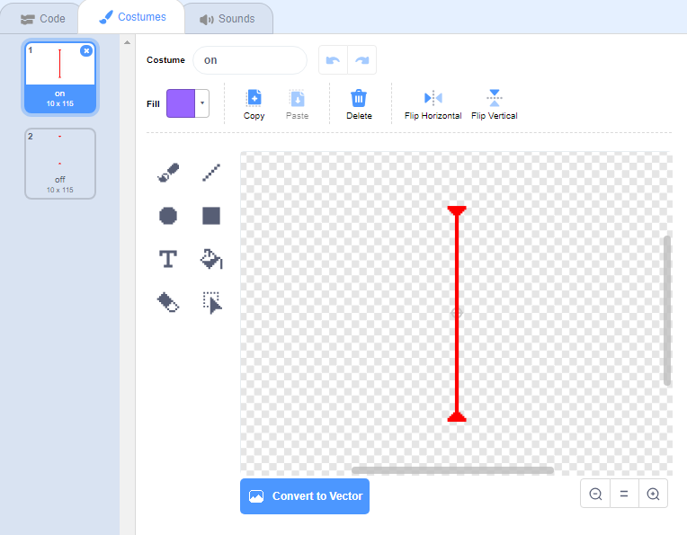

## लेज़र!

आपके गेम को पूरा करना और कठिन बनाने के लिए, आप इसमें लेज़र जोडेंगे!

--- task ---

अपनी गेम में एक नया sprite जोडें और उसे नाम दें `laser`। उसके पास दो costume होने चाहिए: एक होगा 'on', और दूसरा होगा 'off'।




--- /task ---

--- task ---

दो प्लेटफार्मों के बीच अपने नए लेज़र sprite को रखें।


--- /task ---

--- task ---

अपने लेज़र sprite में कोड जोड़ें इसे अपने दो costumes के बीच स्विच करने के लिए।


```blocks3
    when flag clicked
    forever
        switch costume to (on v)
        wait (2) seconds
        switch costume to (off v)
        wait (2) seconds
    end
```

यदि आप चाहें, तो आप ऊपर दिखाए गए कोड को बदल सकते हैं ताकि sprite `waits`{:class="block3control"} एक `random`{:class="block3operators"} समय के लिए costume परिवर्तन के बीच।

--- /task ---

--- task ---

अंत में, अपने लेज़र sprite में कोड जोड़ें ताकि लेजर sprite एक 'hit' संदेश प्रसारित करे जब यह पात्र sprite को छूता है।

--- hints ---


--- hint ---

यह कोड आपके गेंद sprite में जोड़े गए कोड के समान होना चाहिए।

--- /hint ---

--- hint ---

गेंद sprite में जोड़े गए कोड की प्रतिलिपि बनाएँ इस sprite को `broadcast 'hit'`{:class="block3control"} करवाने के लिए जब भी ये `touching your character`{:class="block3sensing"}।

--- /hint ---

--- hint ---

यह वह कोड है जिसे आपको जोड़ना चाहिए:


```blocks3
when green flag clicked
forever 
  if <touching (Pico walking v) ?> then 
    broadcast (hit v)
  end
end
```

--- /hint ---

--- /hints ---

आपको अपने पात्र sprite में कोई अधिक कोड जोड़ने की कोई ज़रुरत नहीं है, क्युकी पात्र sprite पहले से ही जानता है उसे क्या करना है जब उसे `broadcast 'hit'`{:class="block3control"} मिलता है!

--- /task ---

--- task ---

अपने गेम का परीक्षण करके देखें कि क्या आप पात्र को लेजर से आगे बढ़ा सकते हैं। यदि लेज़र से बचना बहुत आसान या बहुत कठिन है, तो `wait`{:class="block3control"} समय को बदलें लेजर sprite के लिए।

--- /task ---