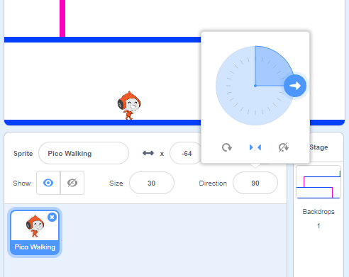
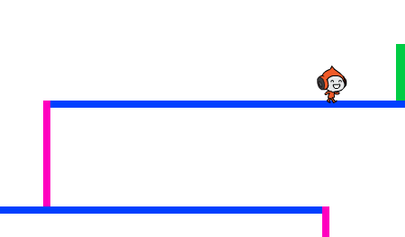

## Character movement

Let's start by creating a character that can move left and right, as well as climb up ladders.

+ Open the 'Dodgeball' Scratch project online at <a href="http://jumpto.cc/dodge-go" target="_blank">jumpto.cc/dodge-go</a> or download from <a href="http://jumpto.cc/dodge-get" target="_blank">jumpto.cc/dodge-get</a> and then open if you are using the offline editor.
    
    The project contains a background with platforms:
    
    

+ Add a new sprite, which will be your character. It's better if you choose a sprite with multiple costumes, so that you can make it look as though it's walking.
    
    

+ Let's use the arrow keys to move your character around. When the player presses the right arrow, you want your character to point right, move a few steps and change to the next costume:
    
    ```blocks
        when flag clicked
        forever
            if <key [right arrow v] pressed? > then
                point in direction (90 v)
                move (3) steps
                next costume
            end
        end
    ```

+ Test out your character by clicking the flag and then holding down the right arrow key. Does your player move to the right? Does your character look like they are walking?
    
    

+ To move your character to the left, you'll need to add another `if`{:class="blockcontrol"} block inside your `forever`{:class="blockcontrol"} loop, which moves your character to the left.

+ Test your new code to make sure that it works. Does your character turn upside-down when walking to the left?
    
    
    
    If so, you can fix this bug by clicking the `(i)`{:class="blocksensing"} icon on your character sprite, and then clicking the left-right arrow.
    
    
    
    Or, if you prefer you can add this block to the start of your character's script:
    
    ```scratch
    set rotation style [left-right v]
    ```

+ To climb a pink ladder, your character should move up slightly whenever the up arrow is pressed and they're touching the correct colour. Add this code inside your character's `forever`{:class="blockcontrol"} loop:
    
    ```blocks
        if < <key [up arrow v] pressed?> and <touching color [#FF69B4]?> > then
            change y by (4)
        end
    ```

+ Test your character - can you climb the pink ladders and get to the end of your level?
    
    