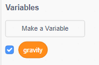

## Gravità e salti

Facciamo muovere il perosnaggio in maniera più realistica, aggiungendo la gravità e permettendogli di saltare.

## Lista delle attività { .check}

+ Avrai notato che il tuo personaggio può scendere dalla piattaforma a mezz'aria. Prova a scendere da una piattaforma e vedi cosa succede.

	

+ Per risolverlo, aggiungiamo la gravità al tuo gioco. Crea una nuova variabile chiamata `gravità` {.blockdata}. Se vuoi, puoi nascondere questa variabile dal quadro.

	

+ Aggiungi questo nuovo codice, che colloca la gravità a un numero negativo, e poi usalo per cambiare ripetutamente la coordinata y del tuo personaggio.

	```blocks
		quando si clicca sulla bandiera verde
		porta [gravità v] a [-4]
		per sempre
  			cambia y di (gravità)
		end
	```

+ Clicca sulla bandiera e poi trascina il personaggio nella parte alta del quadro. Cosa succede? La gravità funziona come previsto?

	

+ La gravità non dovrebbe muovere il tuo personaggio attraverso una piattaforma o una scala! Aggiungi un blocco `se` {.blockcontrol} al tuo codice, in modo che la gravità funzioni solo quando il personaggio si trova a mezz'aria. Il codice della gravità ora dovrebbe apparire così:

	```blocks
		quando si clicca sulla bandiera verde
		porta [gravità v] a [-4]
		per sempre
  			se <non <<sta toccando il colore [#0000FF]> o <sta toccando il colore [#FF69B4]>>> allora
    			cambia y di (gravità)
  			end
		end
	```

+ Prova di nuovo la gravità. Il tuo personaggio si ferma quando si trova su una piattaforma o una scala? Puoi scendere dal bordo della piattaforma al livello inferiore?

	

+ Facciamo anche saltare il personaggio quando il giocatore preme la barra spaziatrice. Si può fare facilmente facendo muovere un po' di volte il personaggio verso l'alto, usando questo codice:

	```blocks
		quando si preme il tasto [spazio v]
		ripeti (10) volte
  			cambia y di (4)
		end
	```

	Siccome la gravità continua a spingere il personaggio verso il basso di 4 pixel, dovrai scegliere un numero maggiore di 4 nel tuo blocco `cambia y di (4)` {.blockmotion}. Cambia questo numero fino ad arrivare all'altezza desiderata dei salti.

+ Se provi questo codice, noterai che funziona, ma che il movimento non è molto naturale. Per rendere il salto più naturale, dovrai muovere il personaggio in quantità sempre più piccole, finché non salta più.

+ Per fare ciò, crea un'altra variabile chiamata `altezza salto` {.blockdata}. Come prima, puoi nascondere questa variabile se preferisci.

+ Cancella il codice del salto che hai aggiunto al personaggio, e sostituiscilo con questo codice:

	```blocks
		quando si preme il tasto [spazio v]
		porta [altezza salto v] a [8]
		ripeti fino a quando <(altezza salto) = [0]>
  			cambia y di (altezza salto)
  			cambia [altezza salto v] di (-0.5)
		end
	```

	Questo codice fa salire il tuo personaggio di 8 pixel, poi 7,5, poi 7, e così via, finché il personaggio smette di saltare. Questo rende il salto molto più naturale.

+ Cambia il valore iniziale della variabile `altezza salto` {.blockdata} e provalo finché raggiungi l'altezza desiderata.
