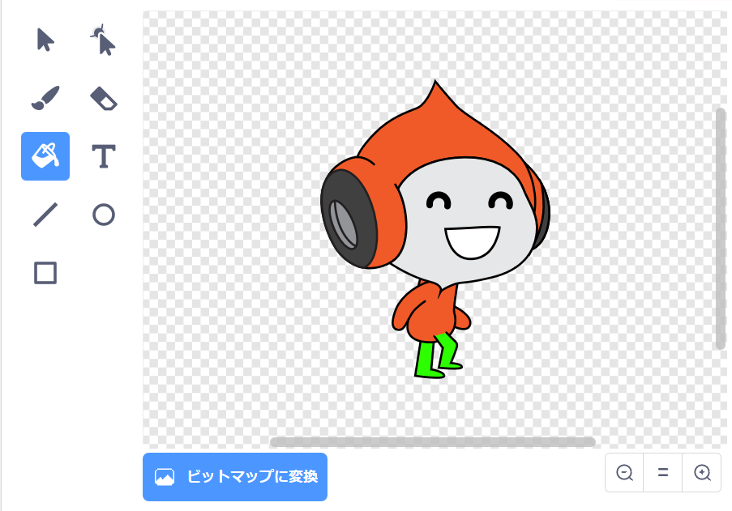

## チャレンジ: 重力をより良くする

ゲームにはもう1つの小さなバグがあります: スプライトの**どんな**一部が青い床に触れていても、重力がキャラクタースプライトを下のほうに引きません、 そのため、スプライトの頭が床に触れても、スプライトは落ちません！ これを自分でテストすることができます: キャラクターにはしごの大部分登らせてから、床の下でキャラクターを横に動かします：


バグを修正するには、最初にキャラクタースプライトに異なる色(**すべての**衣装について) の新しいズボンを与える必要があります。



次に、このコードブロックに置き換えます:

```blocks3
    <[#0000FF] いろにふれた>
```

このコードブロックで:

```blocks3
    <[#00FF00] いろが [#0000FF] いろにふれた>
```

バグを修正したことを確認するには、これらの変更を行った後にゲームをテストしてください！