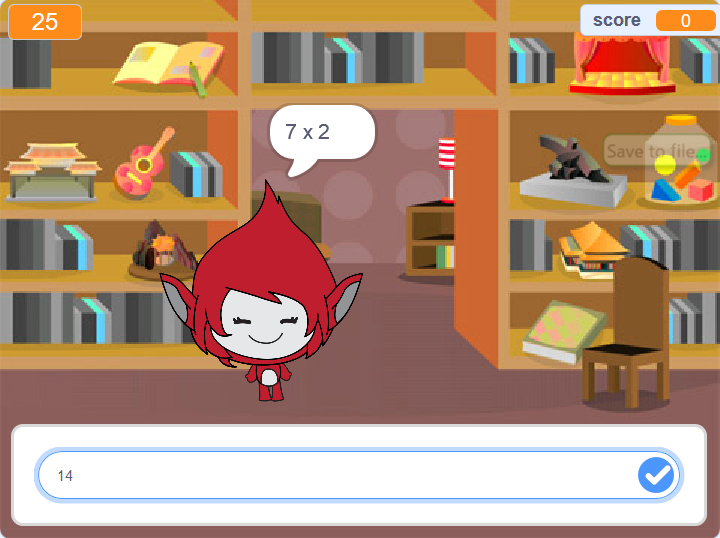

## 次は何をしますか？

数学クイズが作れる、[脳力ゲーム](https://projects.raspberrypi.org/ja-JP/projects/brain-game?utm_source=pathway&utm_medium=whatnext&utm_campaign=projects)プロジェクトをお試しください。

--- no-print ---

ボタンをクリックして開始します。 質問への回答を入力し、<kbd>Enter</kbd>キーを押します。

  <iframe allowtransparency="true" width="485" height="402" src="https://scratch.mit.edu/projects/embed/250234955/?autostart=false" frameborder="0" scrolling="no"></iframe>
  

--- /no-print ---

--- print-only ---

--- /print-only ---

***
コミュニティによる翻訳

このプロジェクトの翻訳は 斉藤友明、レビューは Misato Kano が行いました。

すばらしい翻訳ボランティアは、世界中の子供たちにコーディングを学ぶチャンスを与えるのに役立っています。私たちのプロジェクトを翻訳することにより、より多くの子供たちにプログラミングを学んでもらう事ができます。詳しくは[rpf.io/translate](https://rpf.io/translate)をご覧ください。