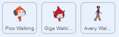

## Character movement

左右に移動でき、はしごを登ることができるキャラクターを作成することから始めます。

\--- task \---

'Dodgeball' スクラッチスタータープロジェクトを開きます。

**Online:** [rpf.io/dodgeball-on](http://rpf.io/dodgeball-on){:target="_blank"}にあるスタータープロジェクトを開きます。

If you have a Scratch account you can make a copy by clicking **Remix**.

**Offline:** [rpf.io/p/en/dodgeball-get](http://rpf.io/p/en/dodgeball-get)からスタータープロジェクトをダウンロードして、オフラインエディターで開きます。

\--- /task \---

プロジェクトには、プラットフォームのある背景が含まれています。


\--- task \---

プレーヤーが制御するキャラクターとして新しいスプライトを選択し、プロジェクトに追加します。 複数のコスチュームを持つスプライトを選択すると、歩いているように見せることができます。



[generic-scratch3-sprite-from-library]]]

\--- /task \---

\--- task \---

プレイヤーが矢印キーでキャラクターを移動できるように、キャラクタースプライトにコードブロックを追加します。 プレイヤーが右矢印を押すと、キャラクターは右を向き、数歩移動して次のコスチュームに変更します。


```blocks3
フラグが押されたとき
ずっと
　<  (右向き矢印v) キーが押された > なら
       (90 v) 度に向ける 
       (3) 歩動かす
        次のコスチュームにする
    終了
終了
```

\--- /task \---

\--- task \---

スプライトが収まらない場合は、サイズを調整します。


\--- /task \---

\--- task \---

フラグをクリックしてから右矢印キーを押して、キャラクターをテストします。 キャラクターは右に移動しますか？ キャラクターは歩いているように見えますか？


\--- /task \---

\--- task \---

キャラクタースプライトに`ずっと` {:class="block3control"}ループ加えたので、左矢印キーが押されると左に移動します。

\--- hints \---

\--- hint \---

キャラクターが左に移動できるようにするには、 ` forever` {:class="block3control"}ループの内側に、別の` if`{:class="block3control"}ブロックを追加する必要があります。 In this new `if`{:class="block3control"} block, add code to make your character sprite `move`{:class="block3motion"} to the left.

\--- /hint \---

\--- hint \---

Copy the code you created to make the character walk to the right. Then set the `key pressed`{:class="block3sensing"} to the `left arrow`{:class="block3sensing"}, and change the `direction`{:class="block3motion"} to `-90`.

```blocks3
if <key (right arrow v) pressed? > then
    point in direction (90 v)
    move (3) steps
    next costume
end
```

\--- /hint \---

\--- hint \---

Your code should look like this now:


```blocks3
when green flag clicked
forever 
  if <key (right arrow v) pressed?> then 
    point in direction (90 v)
    move (3) steps
    next costume
  end
  if <key (left arrow v) pressed?> then 
    point in direction (-90 v)
    move (3) steps
    next costume
  end
end
```

\--- /hint \---

\--- /hints \---

\--- /task \---

\--- task \---

Test your new code to make sure that it works. Does your character turn upside-down when walking to the left?


If so, you can fix this by clicking on the **direction** of your character sprite, and then clicking on the left-right arrow.


Or if you prefer, you can also fix the problem by adding this block to the start of your character's script:

```blocks3
set rotation style [left-right v]
```

\--- /task \---

\--- task \---

To climb a pink ladder, your character sprite should move a few steps upwards on the Stage whenever the up arrow is pressed **and** the character is touching the correct colour.

Add inside your character's `forever`{:class="block3control"} loop to `change`{:class="block3motion"} the character's `y` (vertical) position `if`{:class="block3control"} the `up arrow is pressed`{:class="block3sensing"} and the character is `touching the colour pink`{:class="block3sensing"}.


```blocks3
    if < <key (up arrow v) pressed?> and <touching color [#FF69B4]?> > then
        change y by (4)
    end
```

\--- /task \---

\--- task \---

Test your code. Can you make the character climb the pink ladders and get to the end of the level?


\--- /task \---