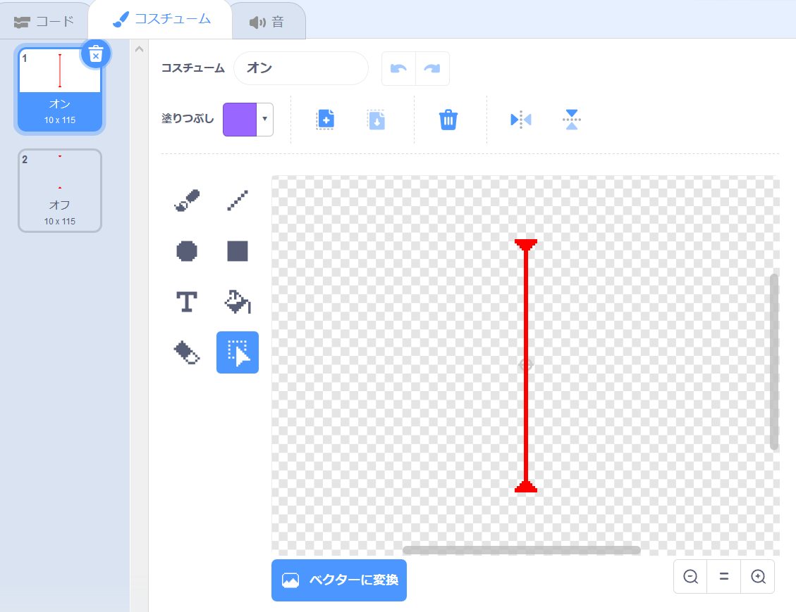

## レーザー！

ゲームを完成させるのが少し難しくするために、レーザーを追加します！

\--- task \---

新しいスプライトをゲームに追加し、それを` laser` と呼びます。 2つのコスチュームが必要です: 1つは「オン」、もう1つは「オフ」です。




\--- /task \---

\--- task \---

2つのプラットフォームの間に新しいレーザースプライトを配置します。


\--- /task \---

\--- task \---

レーザースプライトにコードを追加して、2つのコスチュームを切り替えます。


```blocks3
    フラグが押されたとき
    ずっと
        コスチュームを(オン v) にする
        (2) 秒待つ
        コスチュームを(オフ v) にする
        (2) 秒待つ
    終了
```

If you prefer, you can change the code shown above so that the sprite `waits`{:class="block3control"} a `random`{:class="block3operators"} amount of time between costume changes.

\--- /task \---

\--- task \---

Finally, add code to your laser sprite so that the laser sprite broadcasts a 'hit' message when it touches the character sprite.

\--- ヒント \---

\--- hint \---

This code should be very similar to the code you added to your ball sprite.

\--- /ヒント \---

\--- hint \---

Copy the code you add to the ball sprite to make this sprite `broadcast 'hit'`{:class="block3control"} when it is `touching your character`{:class="block3sensing"}.

\--- /ヒント \---

\--- hint \---

This is the code you should add:


```blocks3
when green flag clicked
forever 
  if <touching (Pico walking v) ?> then 
    broadcast (hit v)
  end
end
```

\--- /ヒント \---

\--- /ヒント \---

You don't need to add any extra code to your characters sprite, because the character sprite already knows what to do when it receives the `broadcast 'hit'`{:class="block3control"}!

\--- /task \---

\--- task \---

Test out your game to see if you can move the character past the laser. If the laser is too easy or too hard to avoid, change the `wait`{:class="block3control"} times in the code for the laser sprite.

\--- /task \---