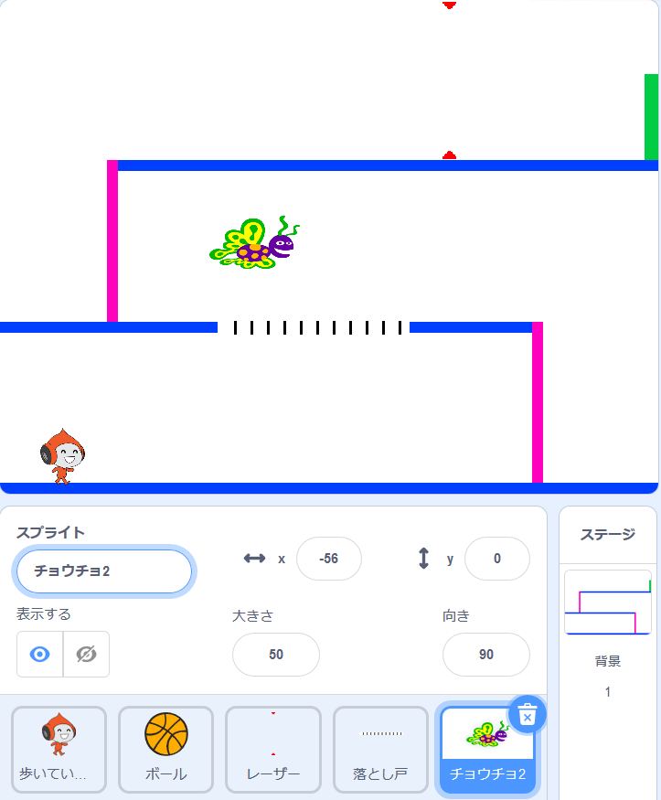

## Challenge: 障害物の追加

ゲームがまだ簡単すぎると思われる場合は、さらに障害を追加できます。 障害物は何でも可能です 例えば:

+ 危険な蝶
+ 現れたり消えたりするプラットフォーム
+ 避けなければならない落ちてくるテニスボール



別の背景を設計して、次のレベルを作成することもできます。 次に、コードを追加して、キャラクターが緑のドアに到達すると、ゲームが新しい背景に切り替わるようにします。


```blocks3
    もし <touching color [#00FF00]?> なら
        背景を(次の背景 v) に切り替える
        x座標を(-210) 、y座標を(-120) にする
        (1) 秒待つ
    終了
```