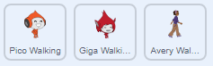

## ಪಾತ್ರ ಚಲನೆ

ಎಡ ಮತ್ತು ಬಲಕ್ಕೆ ಚಲಿಸಬಲ್ಲ ಮತ್ತು ಏಣಿಗಳನ್ನು ಏರುವಂತಹ ಅಕ್ಷರವನ್ನು ರಚಿಸುವ ಮೂಲಕ ಪ್ರಾರಂಭಿಸಿ.

--- task ---

'Dodgeball' Scratch starter ಯೋಜನೆಯನ್ನು ತೆರೆಯಿರಿ.

**Online:** [rpf.io/dodgeball-on](http://rpf.io/dodgeball-on){:target="_blank"}. ನಲ್ಲಿ ಸ್ಟಾರ್ಟರ್ ಯೋಜನೆಯನ್ನು ತೆರೆಯಿರಿ.

ನೀವು Scratch ಖಾತೆಯನ್ನು ಹೊಂದಿದ್ದರೆ **Remix** ಕ್ಲಿಕ್ ಮಾಡುವ ಮೂಲಕ ನೀವು ನಕಲನ್ನು ಮಾಡಬಹುದು.

**Offline:** [rpf.io/p/kn-IN/dodgeball-get](http://rpf.io/p/kn-IN/dodgeball-get) ನಿಂದ ಪ್ರಾರಂಭ ಯೋಜನೆಯನ್ನು ಡೌನ್‌ಲೋಡ್ ಮಾಡಿ, ತದನಂತರ ಅದನ್ನುOffline editor ಬಳಸಿ ತೆರೆಯಿರಿ.

--- /task ---

ಯೋಜನೆಯು ಪ್ಲಾಟ್‌ಫಾರ್ಮ್‌ಗಳೊಂದಿಗೆ ಹಿನ್ನೆಲೆ ಹೊಂದಿದೆ:


--- task ---

ಆಟಗಾರನು ನಿಯಂತ್ರಿಸುವ ಪಾತ್ರದಂತೆ ಹೊಸ sprite ಅನ್ನು ಆರಿಸಿ ಮತ್ತು ಅದನ್ನು ನಿಮ್ಮ ಯೋಜನೆಗೆ ಸೇರಿಸಿ. ನೀವು ಅನೇಕ ವೇಷಭೂಷಣಗಳನ್ನು ಹೊಂದಿರುವ ಸ್ಪ್ರೈಟ್ ಅನ್ನು ಆರಿಸಿದರೆ ಅದು ಉತ್ತಮವಾಗಿರುತ್ತದೆ, ಇದರಿಂದಾಗಿ ನೀವು ಇದನ್ನು ನಡೆಯುತ್ತಿರುವಂತೆ ಕಾಣಿಸಬಹುದು.



[[[generic-scratch3-sprite-from-library]]]

--- /task ---

--- task ---

ನಿಮ್ಮ sprite ಪಾತ್ರಕ್ಕೆ ಕೋಡ್ ಬ್ಲಾಕ್‌ಗಳನ್ನು ಸೇರಿಸಿ ಇದರಿಂದ ಆಟಗಾರನು ಪಾತ್ರವನ್ನು ಸರಿಸಲು arrow ಕೀ ಗಳನ್ನು ಬಳಸಬಹುದು. ಆಟಗಾರನು right arrow ವನ್ನು ಒತ್ತಿದಾಗ, ಪಾತ್ರವು ಬಲಕ್ಕೆ ಸೂಚಿಸಬೇಕು, ಕೆಲವು ಹಂತಗಳನ್ನು ಸರಿಸಬೇಕು ಮತ್ತು ಮುಂದಿನ ಉಡುಪಿಗೆ ಬದಲಾಗಬೇಕು:


```blocks3
when flag clicked
forever
    if <key (right arrow v) pressed? > then
        point in direction (90 v)
        move (3) steps
        next costume
    end
end
```

--- /task ---

--- task ---

ನಿಮ್ಮ sprite ಹೊಂದಿಕೆಯಾಗದಿದ್ದರೆ, ಅದರ ಗಾತ್ರವನ್ನು ಹೊಂದಿಸಿ.


--- /task ---

--- task ---

ಧ್ವಜವನ್ನು ಕ್ಲಿಕ್ ಮಾಡಿ ಮತ್ತು ನಂತರ right arrow ಕೀ ಅನ್ನು ಹಿಡಿದಿಟ್ಟುಕೊಳ್ಳುವ ಮೂಲಕ ನಿಮ್ಮ ಪಾತ್ರವನ್ನು ಪರೀಕ್ಷಿಸಿ. ನಿಮ್ಮ ಪಾತ್ರ ಬಲಕ್ಕೆ ಚಲಿಸುತ್ತದೆಯೇ? ನಿಮ್ಮ ಪಾತ್ರವು ನಡೆಯುತ್ತಿರುವಂತೆ ಕಾಣಿಸುತ್ತದೆಯೇ?


--- /task ---

--- task ---

sprite ಪಾತ್ರದ `forever`{:class="block3control"} loop ಗೆ ಕೋಡ್ ಬ್ಲಾಕ್ ಗಳನ್ನು ಸೇರಿಸಿ ಆದ್ದರಿಂದ left arrow ಕೀ ಅನ್ನು ಪ್ರೆಸ್ ಮಾಡಿದಾಗ ಅದು ಎಡಕ್ಕೆ ಚಲಿಸುತ್ತದೆ.

--- hints ---


--- hint ---

ಆದ್ದರಿಂದ ನಿಮ್ಮ ಅಕ್ಷರವು ಎಡಕ್ಕೆ ಚಲಿಸಬಹುದು, `forever`{:class="block3control"} loop ನ ಒಳಗಡೆ ಮತ್ತೊಂದು `if`{:class="block3control"} ಬ್ಲಾಕ್ ಅನ್ನು ಸೇರಿಸಬೇಕಾಗುತ್ತದೆ. ಈ ಹೊಸ `if`{:class="block3control"} ಬ್ಲಾಕ್ ನಲ್ಲಿ, ನಿಮ್ಮ scratch ಪಾತ್ರವನ್ನು ಎಡಕ್ಕೆ `move`{:class="block3motion"} ಮಾಡಲು ಕೋಡ್ ಅನ್ನು ಸೇರಿಸಿ.

--- /hint ---

--- hint ---

ಪಾತ್ರವು ಬಲಕ್ಕೆ ನಡೆಯಲು ನೀವು ರಚಿಸಿದ ಕೋಡ್ ಅನ್ನು ನಕಲಿಸಿ. ನಂತರ `left arrow`{:class="block3sensing"} ಗೆ `key pressed`{:class="block3sensing"} ಅನ್ನು ಸೆಟ್ ಮಾಡಿ, ಮತ್ತು `direction`{:class="block3motion"} ಅನ್ನು `-90` ಗೆ ಬದಲಾಯಿಸಿ.

```blocks3
if <key (right arrow v) pressed? > then
    point in direction (90 v)
    move (3) steps
    next costume
end
```

--- /hint ---

--- hint ---

ನಿಮ್ಮ ಕೋಡ್ ಈ ರೀತಿ ಇರಬೇಕು:


```blocks3
when green flag clicked
forever 
  if <key (right arrow v) pressed?> then 
    point in direction (90 v)
    move (3) steps
    next costume
  end
  if <key (left arrow v) pressed?> then 
    point in direction (-90 v)
    move (3) steps
    next costume
  end
end
```

--- /hint ---

--- /hints ---

--- /task ---

--- task ---

ನಿಮ್ಮ ಹೊಸ ಕೋಡ್ ಕಾರ್ಯನಿರ್ವಹಿಸುತ್ತಿದೆಯೆ ಎಂದು ಖಚಿತಪಡಿಸಿಕೊಳ್ಳಲು ಅದನ್ನು ಪರೀಕ್ಷಿಸಿ. ಎಡಕ್ಕೆ ನಡೆಯುವಾಗ ನಿಮ್ಮ ಪಾತ್ರ ತಲೆಕೆಳಗಾಗಿ ತಿರುಗುತ್ತದೆಯೇ?


ಹಾಗಿದ್ದಲ್ಲಿ, ನಿಮ್ಮ sprite ಪಾತ್ರದ **direction** ಕ್ಲಿಕ್ ಮಾಡುವ ಮೂಲಕ ಮತ್ತು ನಂತರ left-right arrow ಮೇಲೆ ಕ್ಲಿಕ್ ಮಾಡುವ ಮೂಲಕ ನೀವು ಇದನ್ನು ಸರಿಪಡಿಸಬಹುದು.


ಅಥವಾ ನೀವು ಬಯಸಿದರೆ, ನಿಮ್ಮ ಪಾತ್ರದ ಸ್ಕ್ರಿಪ್ಟ್(script)‌ನ ಪ್ರಾರಂಭಕ್ಕೆ ಈ ಬ್ಲಾಕ್ ಅನ್ನು ಸೇರಿಸುವ ಮೂಲಕ ನೀವು ಸಮಸ್ಯೆಯನ್ನು ಪರಿಹರಿಸಬಹುದು:

```blocks3
set rotation style [left-right v]
```

--- /task ---

--- task ---

ಗುಲಾಬಿ ಏಣಿಯನ್ನು ಏರಲು, ನಿಮ್ಮ arrow ಅನ್ನು ಒತ್ತಿದಾಗಲೆಲ್ಲಾ ನಿಮ್ಮ sprite ಪಾತ್ರದ ವೇದಿಕೆಯಲ್ಲಿ ಕೆಲವು ಹೆಜ್ಜೆ ಮೇಲಕ್ಕೆ ಚಲಿಸಬೇಕು **ಮತ್ತು** ನಿಮ್ಮ ಪಾತ್ರವು ಸರಿಯಾದ ಬಣ್ಣಕ್ಕೆ ತಾಕುತ್ತಿರಬೇಕು.

Add inside your character's `forever`{:class="block3control"} loop to `change`{:class="block3motion"} the character's `y` (vertical) position `if`{:class="block3control"} the `up arrow is pressed`{:class="block3sensing"} and the character is `touching the colour pink`{:class="block3sensing"}.


```blocks3
    if < <key (up arrow v) pressed?> and <touching color [#FF69B4]?> > then
        change y by (4)
    end
```

--- /task ---

--- task ---

ನಿಮ್ಮ ಕೋಡ್ ಅನ್ನು ಪರೀಕ್ಷಿಸಿ. ನೀವು ಪಾತ್ರವನ್ನು ಗುಲಾಬಿ ಏಣಿಗಳನ್ನು ಏರಲು ಮತ್ತು ಹಂತದ ಅಂತ್ಯಕ್ಕೆ ಹೋಗುವಂತೆ ಮಾಡಬಹುದೇ?


--- /task ---