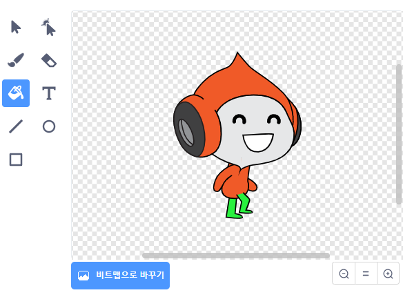

## 도전 과제: 개선된 중력

게임에 또 하나의 작은 버그가 있습니다: 스프라이트의 **어느 곳이든** 일부가 파란색 플랫폼에 닿아 있을 때 중력이 캐릭터를 아래 쪽으로 끌어당기지 않습니다. 그래서 스프라이트의 머리가 플랫폼(장애물)에 닿아도 스프라이트가 떨어지지 않는 것입니다! 이것을 직접 테스트 해보십시오: 캐릭터가 사다리의 가장 위로 올라가도록 한 다음, 캐릭터를 플랫폼 아래 옆으로 움직입니다.


버그를 수정하려면 먼저 캐릭터 스프라이트의 (**모든** 모양에게) 다른 색상의 새로운 바지를 줘야 합니다.



그런 다음, 이 코드 블록을 교체하십시오.

```blocks3
    <[#0000FF] 색에 닿았는가? >
```

아래의 코드 블록으로:

```blocks3
    <[#00FF00] 색이 [#0000FF] 색에 닿았는가? >
```

버그를 수정했는지 확인하려면 위와 같이 변경한 후 게임을 테스트하십시오!