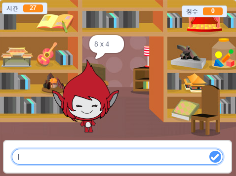

## 더 나아가기

여러분만의 수학 문제를 만들 수 있는 [두뇌 게임](https://projects.raspberrypi.org/en/projects/brain-game?utm_source=pathway&utm_medium=whatnext&utm_campaign=projects) 프로젝트를 해보세요.

\--- no-print \---

시작하려면 버튼을 클릭하세요 질문에 대한 답변을 입력한 다음 <kbd>Enter</kbd> 키를 누르십시오.

  <iframe allowtransparency="true" width="485" height="402" src="https://scratch.mit.edu/projects/embed/250234955/?autostart=false" frameborder="0" scrolling="no"></iframe>
  

\--- /no-print \---

\--- print-only \---

\--- /print-only \---