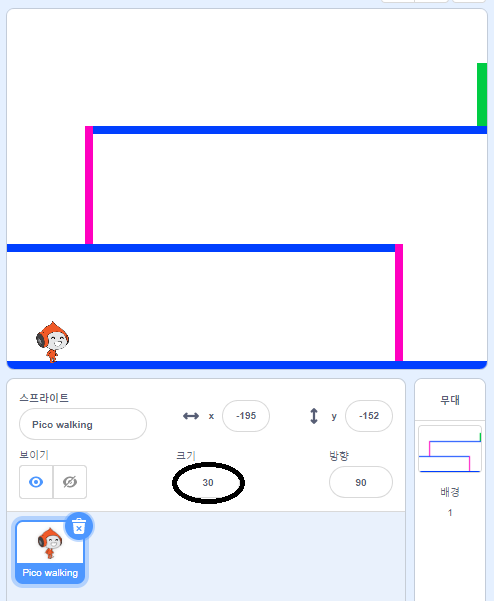
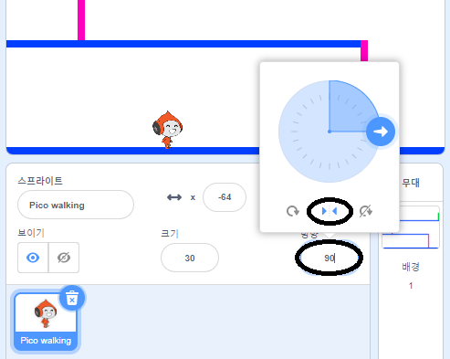

## 캐릭터 이동

왼쪽과 오른쪽으로 움직일 수 있고 사다리를 올라갈 수 있는 캐릭터를 만드는 것으로 시작합시다.

--- task ---

'피구 게임' 스크래치 스타터 프로젝트를 여십시오.

**온라인:** [rpf.io/dodgeball-on](http://rpf.io/dodgeball-on){:target="_blank"}에서 새로운 스타터 프로젝트 열기.

스크래치 계정이 있는 경우 **리믹스**를 클릭하여 사본을 만들 수 있습니다.

**오프라인:** 스타터 프로젝트를 [rpf.io/p/ko-KR/dodgeball-get](http://rpf.io/p/ko-KR/dodgeball-get){:target="_blank"} 에서 다운로드하고, 오프라인 편집기로 파일을 엽니다.

--- /task ---

이 프로젝트에는 플랫폼이 그려진 배경이 포함되어 있습니다.


--- task ---

플레이어가 제어할 캐릭터로 새로운 스프라이트를 선택하고 프로젝트에 추가하십시오. 모양이 여러개인 스프라이트를 선택하면 걷는 것처럼 보이게 할 수 있습니다.


[[[generic-scratch3-sprite-from-library]]]

--- /task ---

--- task ---

플레이어가 화살표 키를 사용하여 캐릭터를 움직일 수 있도록, 캐릭터 스프라이트에 코드 블록을 추가하십시오. 플레이어가 오른쪽 화살표를 누르면 캐릭터가 오른쪽을 보고, 몇 발짝 이동한 후 다음 모양으로 변경되어야 합니다.


```blocks3
⚑ 클릭했을 때
무한 반복하기 
  만약 <(오른쪽 화살표 v) 키를 눌렸는가? > \(이\)라면 
    (90 v) 도 방향 보기
    (3) 만큼 움직이기
    다음 모양으로 바꾸기
  end
end
```

--- /task ---

--- task ---

스프라이트의 크기가 적절치 않으면 조정하십시오.



--- /task ---

--- task ---

깃발을 클릭한 다음 오른쪽 화살표 키를 눌러 캐릭터를 테스트해보세오. 캐릭터가 오른쪽으로 이동하나요? 캐릭터가 걷고있는 것처럼 보입니까?


--- /task ---

--- task ---

캐릭터 스프라이트에 `무한 반복`{:class="block3control"} 코드 블록을 추가해서 왼쪽 화살표 키를 누르면 왼쪽으로 걷도록 하십시오.

--- hints ---


--- hint ---

캐릭터가 왼쪽으로 이동할 수 있게 하려면 `만약`{:class="block3control"} 코드 블록을 `무한 반복`{:class="block3control"} 코드 블록 안에 추가해야 합니다. 새로운 `만약`{:class="block3control"} 코드 블록 안에는 캐릭터 스프라이트를 왼쪽으로 `움직이기`{:class="block3motion"} 코드를 추가합니다.

--- /hint ---

--- hint ---

캐릭터가 오른쪽으로 걸어가도록 만든 코드를 복사하십시오. 그런 다음, `키를 눌렀을 때`{:class="block3sensing"} 블록을 `왼쪽 화살표`{:class="block3sensing"}로 설정하고 `방향`{:class="block3motion"}을 `-90`으로 변경합니다.

```blocks3
만약 <(오른쪽 화살표 v) 키를 눌렸는가? > \(이\)라면 
  (90 v) 도 방향 보기
  (3) 만큼 움직이기
  다음 모양으로 바꾸기
end
```

--- /hint ---

--- hint ---

다음과 같은 코드가 될 것입니다:


```blocks3
⚑ 클릭했을 때
무한 반복하기
  만약 <(오른쪽 화살표 v) 키를 눌렸는가?> \(이\)라면 
    (90 v) 도 방향 보기
    (3) 만큼 움직이기
    다음 모양으로 바꾸기
  end
  만약 <(왼쪽 화살표 v) 키를 눌렸는가?> \(이\)라면 
    (-90 v) 도 방향 보기
    (3) 만큼 움직이기
    다음 모양으로 바꾸기
  end
end
```

--- /hint ---

--- /hints ---

--- /task ---

--- task ---

새 코드를 테스트하여 작동하는지 확인하십시오. 왼쪽으로 걸어갈 때 캐릭터가 거꾸로 되어 있습니까?


그렇다면 캐릭터 스프라이트의 **방향**을 클릭한 뒤, 왼쪽-오른쪽 화살표를 클릭해서 이 문제를 해결할 수 있습니다.



또는 원하는 경우 캐릭터의 스크립트 시작 부분에 이 블록을 추가하여 문제를 해결할 수도 있습니다.

```blocks3
set rotation style [왼쪽-오른쪽 v]
```

--- /task ---

--- task ---

분홍색 사다리를 오르기 위해, 위쪽 화살표를 **누른 채로** 캐릭터 스프라이트가 올바른 색상에 닿을 때마다 스테이지에서 좀 더 위로 움직여야 합니다.

캐릭터의 `무한 반복`{:class="block3control"} 코드 블록에 `만약`{:class="block3control"} `위쪽 화살표가 눌렸고`{:class="block3sensing"} 캐릭터가 `분홍색에 닿았다면`{:class="block3sensing"} 캐릭터의 `y` (수직) 위치를 `변경`{:class="block3motion"} 하는 코드를 추가합니다.


```blocks3
    if < <key (위쪽 화살표 v) pressed?> and <touching color [#FF69B4]?> > then
		  change y by (4)
	  end
```

--- /task ---

--- task ---

코드를 테스트해 보세요. 캐릭터가 분홍색 사다리를 타고 레벨의 끝까지 가게할 수 있습니까?


--- /task ---