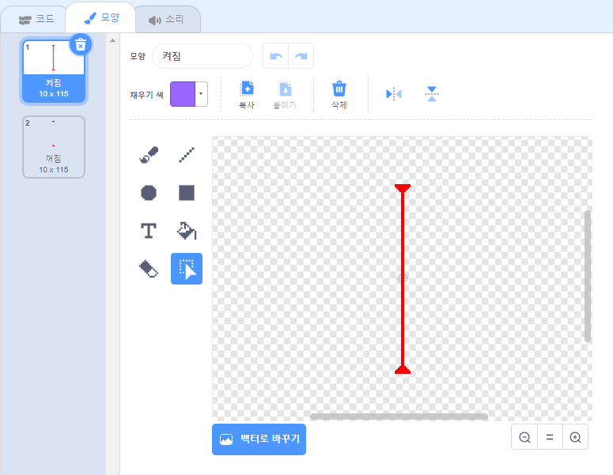
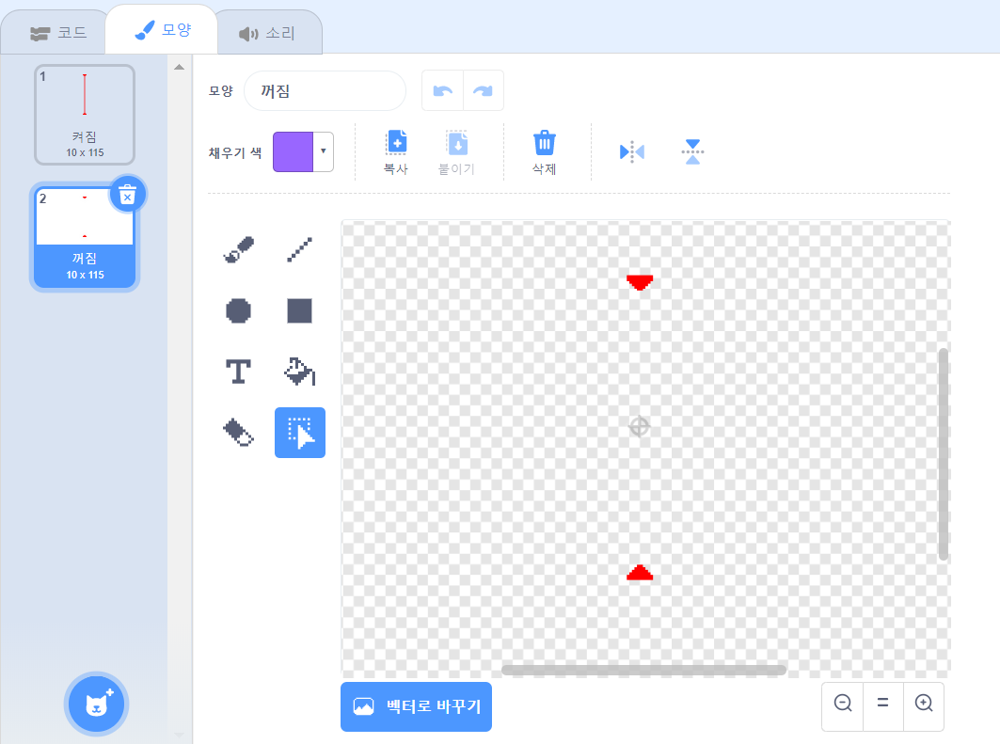

## 레이저!

게임을 조금 더 완료하기 어렵게 하려면, 레이저를 추가하면 됩니다!

\--- task \---

게임에 `레이저`라는 이름의 새로운 스프라이트를 추가합니다. 레이저는 '켜짐'과 '꺼짐'이라는 두 가지 모양을 가지고 있어야 합니다.





\--- /task \---

\--- task \---

두 개의 플랫폼 사이에 새로운 레이저 스프라이트를 배치하십시오.


\--- /task \---

\--- task \---

코드를 추가하여 레이저 스프라이트가 두 가지 모양을 전환할 수 있도록 하십시오.


```blocks3
    ⚑ 클릭했을 때
    무한 반복하기 
        모양을 (켜짐 v) \(으\)로 바꾸기
        (2) 초 기다리기
        모양을 (꺼짐 v) \(으\)로 바꾸기
        (2) 초 기다리기
    end
```

원하는 경우 스프라이트가 `무작위`{:class="block3operators"} 시간 동안 `기다리기`{:class="block3control"} 한 다음 모양을 변경하도록 위에 보이는 코드를 변경할 수 있습니다.

\--- /task \---

\--- task \---

마지막으로, 레이저 스프라이트가 캐릭터 스프라이트에 닿을 때 'hit' 메시지를 보내도록 레이저 스프라이트에 코드를 추가하십시오.

\--- hints \---

\--- hint \---

이 코드는 공 스프라이트에 추가한 코드와 매우 비슷할 것입니다.

\--- /hint \---

\--- hint \---

공 스프라이트에 추가한 코드를 복사하여 레이저 스프라이트가 `캐릭터에 닿았을 때`{:class="block3sensing"} `'hit' 신호 보내기`{:class="block3control"}를 하도록 만듭니다.

\--- /hint \---

\--- hint \---

다음은 추가해야 할 코드입니다:


```blocks3
⚑ 클릭했을 때
무한 반복하기 
  만약 <touching (Pico walking v) ?> \(이\)라면 
    (hit v) 신호 보내기
  end
end
```

\--- /hint \---

\--- /hints \---

캐릭터 스프라이트는 `'hit' 신호 보내기`{:class="block3control"}를 받을 때 수행할 작업을 이미 알고 있으므로, 캐릭터 스프라이트에 다른 코드를 추가할 필요가 없습니다!

\--- /task \---

\--- task \---

게임을 테스트하여 캐릭터가 레이저를 지나갈 수 있는지 확인하십시오. 레이저를 피하기 너무 쉽거나 어려운 경우, 레이저 스프라이트 코드에서 `기다리기` {:class="block3control"} 시간을 수정합니다.

\--- /task \---