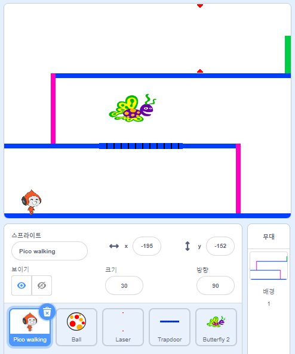

## 도전 과제: 더 많은 장애물

게임이 여전히 너무 쉽다고 생각되면 장애물을 더 추가할 수 있습니다. 장애물은 당신이 원하는 무엇이든 될 수 있습니다! 아래와 같은 아이디어를 제시할 수 있습니다:

+ 위험한 나비
+ 나타났다 사라지는 플랫폼
+ 피해야 하는 떨어지는 테니스 공



다음 단계를 만들기 위해 다른 배경을 디자인 할 수도 있습니다. 그렇다면 캐릭터가 녹색 문에 도달했을 때, 게임이 새로운 배경으로 전환되도록 코드를 추가하십시오.


```blocks3
    만약 <touching color [#00FF00]?> \(이\)라면 
  배경을 (새 배경 v) \(으\)로 바꾸기
  x: (-210) y: (-120) \(으\)로 이동하기
  (1) 초 기다리기
end
```