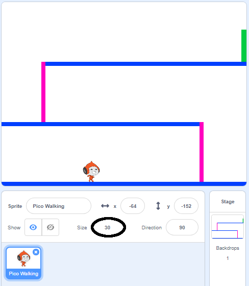

## पात्राची हालचाल

सुरुवात डावीकडे आणि उजवीकडे सरकू शकणारे आणि शिडी चढू शकणारे असे एखादे पात्र तयार करुन करा.

--- task ---

'डॉजबॉल' स्क्रॅच स्टार्टर प्रकल्प उघडा.

**ऑनलाइन:** स्टार्टर प्रकल्प [rpf.io/dodgeball-on](http://rpf.io/dodgeball-on){:target="_blank"} उघडा.

आपल्याकडे स्क्रॅच खाते असल्यास आपण **Remix** वर क्लिक करून प्रत तयार करू शकता.

**ऑफलाइनः** स्टार्टर प्रोजेक्ट [rpf.io/p/mr-IN/dodgeball-get](http://rpf.io/p/mr-IN/dodgeball-get) वरून डाउनलोड करा आणि नंतर ऑफलाइन एडिटर वापरून तो उघडा.

--- /task ---

ह्या प्रकल्पात फलाटासहित बॅकड्रॉप्स आहेत:


--- task ---

खेळाडू नियंत्रित करेल त्या पात्रानुसार एक नवीन स्प्राइट निवडा आणि त्यास आपल्या प्रकल्पात जोडा. आपण एका पेक्षा जास्त पोशाख असलेल्या स्प्राइट ची निवड केल्यास ते जास्त इष्ट, जेणेकरून आपण ते चालत असल्यासारखे भासवू शकता.


[[[generic-scratch3-sprite-from-library]]]

--- /task ---

--- task ---

आपल्या पात्राच्या स्प्राईटमध्ये कोड ब्लॉक जोडा जेणेकरून खेळाडू अॅरो कीज चा वापर करून पात्राला हलवू शकेल. जेव्हा खेळाडू राइट अॅरो की दाबेल, तेव्हा पात्राने उजवीकडे तोंड केले पाहिजे, काही पावलं चाललं पाहिजे आणि पुढचा पोशाख परिधान केला पाहिजे:


```blocks3
when flag clicked
forever
    if <key (right arrow v) pressed? > then
        point in direction (90 v)
        move (3) steps
        next costume
    end
end
```

--- /task ---

--- task ---

जर आपला स्प्राइट बसत नसेल तर त्याचा आकारमान बदला.



--- /task ---

--- task ---

ध्वजावर क्लिक करून आणि नंतर किबोर्ड वरती राइट अॅरो की दाबून आपल्या पात्राची चाचणी घ्या. आपले पात्र उजवीकडे सरकत आहे का? आपले पात्र चालत असल्यासारखे दिसते आहे का?


--- /task ---

--- task ---

तुमच्या पात्राच्या स्प्राईटच्या `forever`{:class="block3control"} लुप ला कोड ब्लॉक जोडा जेणेकरून ते डावीकडे चालेल जेव्हा लेफ्ट अॅरो की दाबली जाईल.

--- hints ---


--- hint ---

जेणेकरून आपले पात्र डावीकडे हलू शकेल, आपल्याला `forever`{:class="block3control"} लुपच्या आत आणखी एक `if`{:class="block3control"} जोडण्याची आवश्यकता आहे. ह्या नविन `if`{:class="block3control"} ब्लॉकमध्ये, कोड जोडा ज्याने तुमच्या पात्राची स्प्राईट डावीकडे `move`{:class="block3motion"} होईल.

--- /hint ---

--- hint ---

पात्र उजवीकडे चालवण्यासाठी आपण तयार केलेला कोड कॉपी करा. त्यांतर `key pressed`{:class="block3sensing"} ला `left arrow`{:class="block3sensing"} सेट करा, आणि `direction`{:class="block3motion"} ला `-90` सेट करा.

```blocks3
if <key (right arrow v) pressed? > then
    point in direction (90 v)
    move (3) steps
    next costume
end
```

--- /hint ---

--- hint ---

आपला कोड आता यासारखा दिसला पाहिजे:


```blocks3
when green flag clicked
forever 
  if <key (right arrow v) pressed?> then 
    point in direction (90 v)
    move (3) steps
    next costume
  end
  if <key (left arrow v) pressed?> then 
    point in direction (-90 v)
    move (3) steps
    next costume
  end
end
```

--- /hint ---

--- /hints ---

--- /task ---

--- task ---

आपला नवीन कोड ठीक चालतोय हे पाहण्यासाठी त्याला चालवून पहा. डावीकडे चालत असताना आपले पात्र उलटे होते?


असेल तर, तुमची ते पात्राच्या स्प्राईटच्या **direction** वर क्लिक करून, आणि नंतर लेफ्ट-राइट अॅरो वर क्लिक करून ठीक करू शकता.


किंवा आपल्याला वाटत असल्यास, आपल्या पात्राच्या स्क्रिप्टच्या सुरूवातीला हा ब्लॉक जोडून आपण समस्येचे निराकरण देखील करू शकता:

```blocks3
set rotation style [left-right v]
```

--- /task ---

--- task ---

जर गुलाबी शिडी चढायची असेल तर तुमच्या पात्राच्या स्प्राईटने फलाटावर काही पावलं वर चढलं पाहिजे जेव्हा जेव्हा अप अॅरो दाबलेला असेल **आणि** पात्र योग्य रंगला स्पर्श करत असायला पाहिजे.

तुमच्या पात्राच्या `forever`{:class="block3control"} लुप च्या आत `change`{:class="block3motion"} जोडा ज्याने तुमच्या पात्राची `y` (उभी) जागा बदलेल `if`{:class="block3control"} (जेव्हा) `अप अॅरो दाबलेला असेल`{:class="block3sensing"} आणि पात्र `गुलाबी रंगाला स्पर्श करत असेल`{:class="block3sensing"}.


```blocks3
    if < <key (up arrow v) pressed?> and <touching color [#FF69B4]?> > then
        change y by (4)
    end
```

--- /task ---

--- task ---

आपल्या कोडची पुन्हा चाचणी घ्या. आपण पात्राला गुलाबी शिडी चढायला लावून पातळीच्या शेवटाला पोहचवू शकता का?


--- /task ---