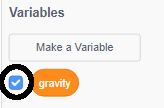

## गुरुत्वाकर्षण आणि उडी मारणे

Now you're going to make your character move more realistically: you're going to add gravity to your game and give the character the ability to jump.

\--- task \---

खेळात आपल्या पात्राची हालचाल अशी करा जेणेकरुन ते फलाटा बाहेर पडेल. तुम्हाला लक्षात आले का ते रिकाम्या जागेत चालू शकत आहे?


\--- /task \---

\--- task \---

हे सुधारित करण्यासाठी आपल्या गेममध्ये गुरुत्वाकर्षण जोडा. हे करण्यासाठी `gravity`{:class="block3variables"} नावाचे नवीन व्हेरिएबल तयार करा.

[[[generic-scratch3-add-variable]]]

आवश्यकता वाटल्यास तुम्ही हे व्हेरिएबल लपवू शकता.



\--- /task \---

\--- task \---

Add these new code blocks that set `gravity` to a negative number and use the value of `gravity` to repeatedly change your character's y-coordinate:


```blocks3
    when flag clicked
    set [gravity v] to [-4]
    forever
        change y by (gravity)
    end
```

\--- /task \---

\--- task \---

ध्वजावर क्लिक करा आणि नंतर आपल्या पात्राला स्टेजच्या शीर्षस्थानी ठेवा. काय होते? आपल्या अपेक्षेनुसार गुरुत्व कार्य करत आहे का?


\--- /task \---

\--- task \---

Gravity shouldn't move the character sprite through a platform or a ladder! Add an `if`{:class="block3control"} block to your code to only let the gravity work when the character is in mid-air. आपल्या गुरुत्वाकर्षणाचा कोड असा दिसला पाहिजे:


```blocks3
    when flag clicked
    set [gravity v] to [-4]
    forever
        if < not < <touching color [#0000FF]?> or <touching color [#FF69B4]?> > > then
            change y by (gravity)
        end
    end
```

\--- /task \---

\--- task \---

गुरुत्वाकर्षण आता योग्य प्रकारे कार्य करते की नाही हे पाहण्यासाठी पुन्हा खेळाची चाचणी घ्या. Does your character sprite stop falling when it touches a platform or a ladder? आपण पात्राला प्लॅटफॉर्मच्या काठावरुन खाली पडून खालच्या पातळीवर जायला भाग पडू शकता?


\--- /task \---

\--- task \---

Now add code to make your character jump whenever the player presses the <kbd>space</kbd> key. असे करण्याचा एक अतिशय सोपा मार्ग म्हणजे आपल्या पात्राला काही वेळा वर आणणे:


```blocks3
    when [space v] key pressed
    repeat (10)
        change y by (4)
    end
```

Because gravity is constantly pushing your character down by 4 pixels, you need to choose a number greater than `4` in your `change y by (4)`{:class="block3motion"} block. जोपर्यंत पात्राची उडी मनासारखी होत नाही उंचीचे आकडे बदला.

\--- /task \---

\--- task \---

आपला कोड तपासून पहा. लक्षात घ्या की उडी मारण्याची हालचालीत गचके येऊ शकतात. To make jumping look smoother, you need to move your character sprite by smaller and smaller amounts, until it is not rising any higher.

\--- /task \---

\--- task \---

To do this, create a new variable called `jump height`{:class="block3variables"}. परत एकदा, आवश्यकता वाटल्यास तुम्ही हे व्हेरिएबल लपवू शकता.

\--- /task \---

\--- task \---

Delete the jumping code you added to your character sprite, and add this code instead:


```blocks3
    when [space v] key pressed
    set [jump height v] to [8]
    repeat until < (jump height) = [0] >
        change y by (jump height)
        change [jump height v] by (-0.5)
    end
```

This code moves your character up by 8 pixels, then 7.5 pixels, then 7 pixels, and so on, until it does not rise any higher. यामुळे उडी मारणे अधिक नितळ होते.

\--- /task \---

\--- task \---

Change the value of the `jump height`{:class="block3variables"} variable that is set before the `repeat`{:class="block3control"} starts. मग आपल्या खेळाची चाचणी घ्या.

Repeat these two steps until you're happy with how high the character jumps.

\--- /task \---