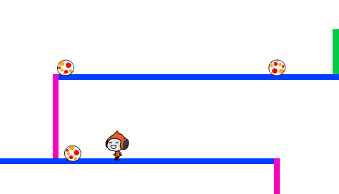

## चेंडुंना चकवा देणे

आपले पात्र आता हलू आणि उडी मारू शकतं, तर आता थोडे चेंडू टाकायची गरज आली आहे जे आपल्या पात्राला चकवावे लागतील.

--- task ---

नवीन चेंडूची स्प्राइट तयार करा. आपल्या आवडीच्या कोणत्याही प्रकारच्या चेंडूची निवड तुम्ही करू शकता.


--- /task ---

--- task ---

चेंडूच्या स्प्राइटचे आकार बदला जेणेकरून पात्र त्यावर उडी मारू शकेल. चेंडू योग्य आकाराचा आहे की नाही हे तपासण्यासाठी तुमच्या पात्राला घेऊन चेंडूवर उडी मारायचा प्रयत्न करा.


--- /task ---

--- task ---

आपल्या चेंडूच्या स्प्राइटमध्ये हा कोड जोडा:


```blocks3
when green flag clicked
hide
forever 
  wait (3) seconds
  create clone of (myself v)
end
```

```blocks3
when I start as a clone
go to x: (160) y: (160)
show
repeat (22) 
  change y by (-4)
end
repeat (170) 
  change x by (-2)
  turn ccw (6) degrees
end
repeat (30) 
  change y by (-4)
end
delete this clone
```

हा कोड दर तीन सेकंदाच्या अवधीने चेंडूच्या स्प्राइटचा नवीन क्लोन तयार करतो. प्रत्येक नवीन क्लोन वरच्या फलाटावर फिरतो आणि नंतर पडतो.

--- /task ---

--- task ---

खेळाची चाचणी घेण्यासाठी ध्वजावर क्लिक करा.



--- /task ---

--- task ---

आपल्या चेंडूच्या स्प्राइटमध्ये अजून कोड जोडा जेणेकरून तिचे क्लोन तीनही प्लॅटफॉर्मवर फिरतील.


--- hints ---


--- hint ---

पहिल्या व्यासपीठावर चेंडूच्या स्प्राईट क्लोन हलविण्यासाठी वापरत असलेल्या कोड ब्लॉक्सची पुनरावृत्ती करा. तुम्हाला `x`{:class="block3motion"}, `y`{:class="block3motion"}, आणि `repeat`{:class="block3control"} च्या आकड्यांना बदलावे लागेल जेणेकरून क्लोन्स् फालाटांना व्यवस्थितरीत्या अनुसरण करतील.

--- /hint ---

--- hint ---

आपल्याला आवश्यक असलेले हे ब्लॉकस् आहेत. आपण त्यांना योग्य क्रमाने जोडले असल्याची खात्री करा.


```blocks3
repeat (170) 
  change x by (-2)
  turn ccw (6) degrees
end

repeat (180) 
  change x by (2)
  turn cw (6) degrees
end

repeat (30) 
  change y by (-4)
end
```

--- /hint ---

--- hint ---

आपल्या चेंडूच्या स्प्राइट क्लोनसाठी कोड यासारखा दिसावा:


```blocks3
when I start as a clone
go to x: (160) y: (160)
show
repeat (22) 
  change y by (-4)
end
repeat (170) 
  change x by (-2)
  turn ccw (6) degrees
end
repeat (30) 
  change y by (-4)
end
repeat (180) 
  change x by (2)
  turn cw (6) degrees
end
repeat (30) 
  change y by (-4)
end
repeat (170) 
  change x by (-2)
  turn ccw (6) degrees
end
delete this clone
```

--- /hint ---

--- /hints ---

--- /task ---

--- task ---

आपल्या पात्राला चेंडू लागल्यास संदेश प्रसारित करण्यासाठी (पाठवण्यासाठी) काही कोड ब्लॉक जोडा!

आपल्या बॉल स्प्राइटमध्ये हा कोड जोडा:


```blocks3
    when I start as a clone
    forever
        if < touching (Pico walking v)? > then
            broadcast (hit v)
        end
    end
```

--- /task ---

--- task ---

सगळ्यात शेवटी, कोड ब्लॉक जोडा ज्याने तुमचे पात्र सुरवातीला परत जाईल जेव्हा त्याला `hit` संदेश मिळेल:


```blocks3
    when I receive [hit v]
    point in direction (90)
    go to x: (-210) y: (-120)
```

--- /task ---

--- task ---

आपला कोड तपासून पहा. बॉलला स्पर्श केल्यानंतर पात्र परत सुरुवातीकडे जातो की नाही ते तपासा.

--- /task ---