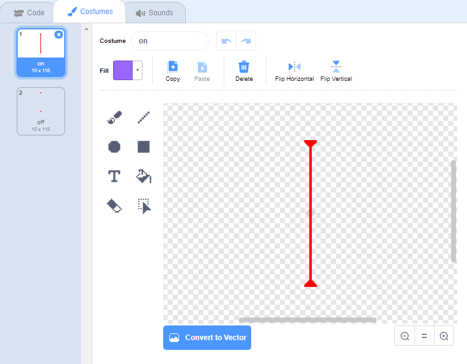

## लेझर!

आपल्या खेळाची काठिन्य पातळी वाढवण्यासाठी आपण लेझर जोडणार आहोत!

\--- task \---

आपल्या गेममध्ये एक नवीन स्प्राइट जोडा आणि त्यास `laser` नाव द्या. त्यास दोन पोशाख असावेत: एक म्हणजे 'on', आणि एक म्हणजे 'off'.




\--- /task \---

\--- task \---

दोन फलाटांच्या मध्ये आपले नवीन लेसर स्प्राइट ठेवा.


\--- /task \---

\--- task \---

त्याच्या दोन पोशाखांमध्ये स्विच करण्यासाठी आपल्या लेसर स्प्राइटमध्ये कोड जोडा.


```blocks3
    when flag clicked
    forever
        switch costume to (on v)
        wait (2) seconds
        switch costume to (off v)
        wait (2) seconds
    end
```

तुम्हाला वाटत असल्यास, तुम्ही वर दाखवलेल्या कोडमध्ये बदल करू शकता जेणेकरून स्प्राईट पोशाख बदल्यामध्ये `random`{:class="block3operators"} काळासाठी `waits`{:class="block3control"}.

\--- /task \---

\--- task \---

शेवटी, आपल्या लेसरच्या स्प्राईटमध्ये कोड जोडा जेणेकरून जेव्हा लेजर स्प्राइट पात्राच्या स्प्राइटला स्पर्श करेल तेव्हा 'hit' संदेश प्रसारित करेल.

\--- hints \---

\--- hint \---

हा कोड आपण आपल्या चेंडूच्या स्प्राइटमध्ये जोडलेल्या कोडसारखाच असावा.

\--- /hint \---

\--- hint \---

हा स्प्राइट बनविण्यासाठी आपण बॉल स्प्राइटमध्ये जोडलेला कोड कॉपी करा `broadcast 'hit'`{:class="block3control"} करा जेव्हा त्याच्या `touching your character`{:class="block3sensing"}.

\--- /hint \---

\--- hint \---

हा कोड आपण जोडावा:


```blocks3
when green flag clicked
forever 
  if <touching (Pico walking v) ?> then 
    broadcast (hit v)
  end
end
```

\--- /hint \---

\--- /hints \---

आपल्याला आपल्या पात्राच्या स्प्राइटमध्ये कोणताही अतिरिक्त कोड जोडण्याची आवश्यकता नाही, कारण पात्राला `broadcast 'hit'`{:class="block3control"} मिळाल्यावर काय करावे हे आधीच ठाऊक आहे!

\--- /task \---

\--- task \---

आपण लेसरच्या मागे असताना पात्र हलवू शकता की नाही हे पाहण्यासाठी आपल्या खेळाची चाचणी घ्या. जर लेसर तळणं जासतीच सोप्पं किंवा कठीण वाटत असल्यास, कोडच्या `wait`{:class="block3control"} मध्ये बदल करा.

\--- /task \---