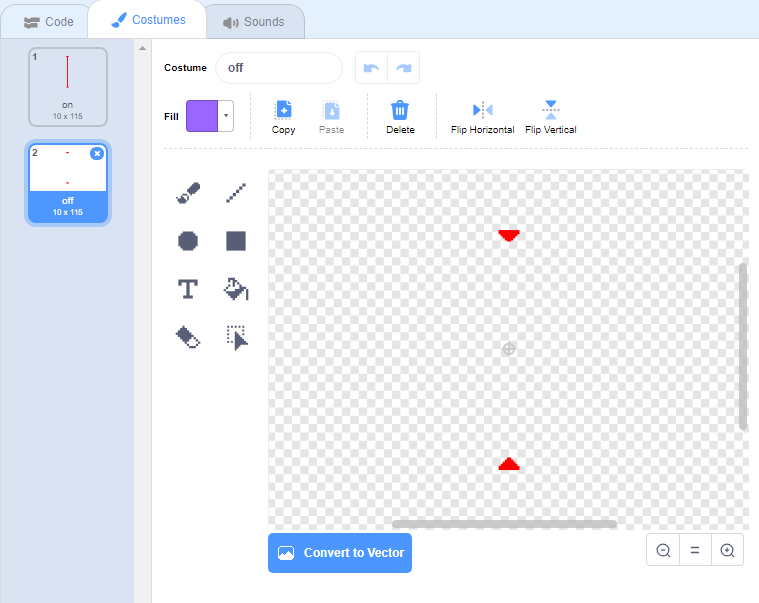

## लेझर!

आपल्या खेळाची काठिन्य पातळी वाढवण्यासाठी आपण लेझर जोडणार आहोत!

\--- task \---

आपल्या गेममध्ये एक नवीन स्प्राइट जोडा आणि त्यास `laser` नाव द्या. त्यास दोन पोशाख असावेत: एक म्हणजे 'चालू', आणि एक म्हणजे 'बंद'.




\--- /task \---

\--- task \---

दोन फलाटांच्या मध्ये आपले नवीन लेसर स्प्राइट ठेवा.


\--- /task \---

\--- task \---

Add code to your laser sprite to make it switch between its two costumes.


```blocks3
    when flag clicked
    forever
        switch costume to (on v)
        wait (2) seconds
        switch costume to (off v)
        wait (2) seconds
    end
```

If you prefer, you can change the code shown above so that the sprite `waits`{:class="block3control"} a `random`{:class="block3operators"} amount of time between costume changes.

\--- /task \---

\--- task \---

Finally, add code to your laser sprite so that the laser sprite broadcasts a 'hit' message when it touches the character sprite.

\--- hints \---

\--- hint \---

This code should be very similar to the code you added to your ball sprite.

\--- /hint \---

\--- hint \---

Copy the code you add to the ball sprite to make this sprite `broadcast 'hit'`{:class="block3control"} when it is `touching your character`{:class="block3sensing"}.

\--- /hint \---

\--- hint \---

हा कोड आपण जोडावा:


```blocks3
when green flag clicked
forever 
  if <touching (Pico walking v) ?> then 
    broadcast (hit v)
  end
end
```

\--- /hint \---

\--- /hints \---

You don't need to add any extra code to your characters sprite, because the character sprite already knows what to do when it receives the `broadcast 'hit'`{:class="block3control"}!

\--- /task \---

\--- task \---

आपण लेसरच्या मागे असताना पात्र हलवू शकता की नाही हे पाहण्यासाठी आपल्या खेळाची चाचणी घ्या. If the laser is too easy or too hard to avoid, change the `wait`{:class="block3control"} times in the code for the laser sprite.

\--- /task \---