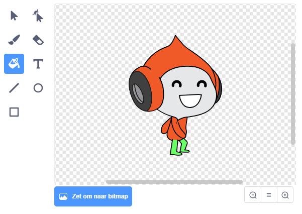

## Uitdaging: verbeterde zwaartekracht

Er is nog een andere kleine fout in het spel: de zwaartekracht trekt je personage niet naar beneden zolang **een** deel ervan een blauw platform raakt. Dus zelfs als het hoofd van de sprite een platform aanraakt, valt de sprite niet! Je kunt dit zelf testen: laat je personage het grootste deel van de ladder beklimmen en verplaats het personage vervolgens zijwaarts onder een platform:


Om de fout te repareren moet je de personage sprite een nieuwe broek geven die een andere kleur heeft (op **alle** uiterlijken).



Vervang vervolgens dit codeblok:

```blocks3
    < raak ik kleur [#0000FF]? >
```

door dit codeblok:

```blocks3
    < kleur [#00FF00] raakt [#0000FF]? >
```

Om zeker te zijn dat je de fout hebt opgelost, test je het spel nadat je deze wijzigingen hebt aangebracht!