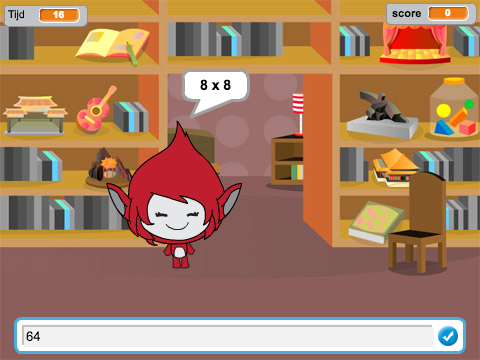

## Wat nu?

Probeer ons [Hersenkraker](https://projects.raspberrypi.org/nl-NL/projects/brain-game?utm_source=pathway&utm_medium=whatnext&utm_campaign=projects) project, waarin je je eigen wiskundequiz kunt maken.

--- no-print --- 
Klik op de knop om te starten. Typ het antwoord op de vraag in en druk vervolgens op de <kbd>Enter</kbd> toets.

  <iframe allowtransparency="true" width="485" height="402" src="https://scratch.mit.edu/projects/embed/250234955/?autostart=false" frameborder="0" scrolling="no"></iframe>
  

--- /no-print ---

--- print-only --- 
 
--- /print-only ---

Door de community geleverde vertaling

Dit project werd vertaald door Guus Koning/Martijn Veld en gecontroleerd door Robert-jan Kempenaar/Cor Groot.

Onze geweldige vertalers helpen ons om kinderen over de hele wereld de kans te geven te leren coderen. Jij kunt ons helpen nog meer kinderen te bereiken door onze projecten te vertalen - lees meer op [rpf.io/translators](https://rpf.io/translators).