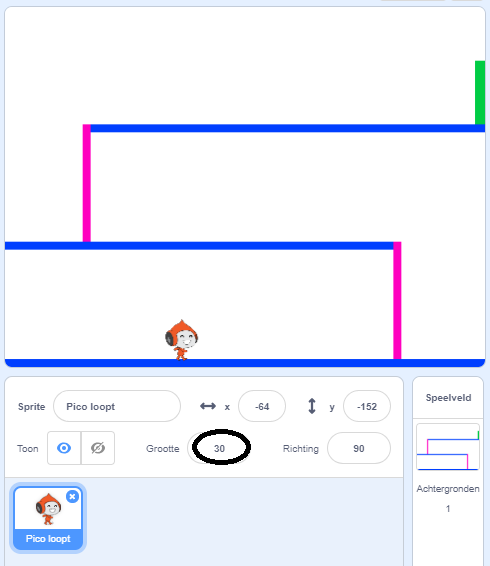
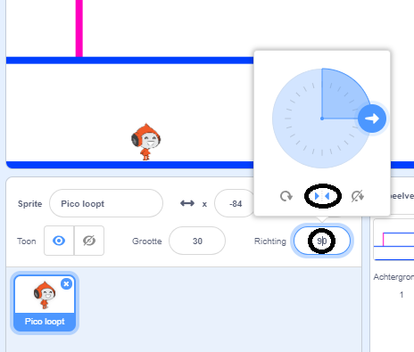

## Voortbeweging personage

Laten we beginnen met het creëren van een personage dat naar links en rechts kan bewegen, maar ook ladders kan beklimmen.

--- task ---

Open het Scratch startersproject 'Dodgeball'.

**Online** open het start project op [rpf.io/dodgeball-on](https://rpf.io/dodgeball-on){:target="_blank"}.

Als je een Scratch-account hebt, kun je een kopie maken door op **Remix** te klikken.

**Offline:** download het startersproject van [rpf.io/p/nl-NL/dodgeball-get](https://rpf.io/p/nl-NL/dodgeball-get) en open het vervolgens met behulp van de offline editor.

--- /task ---

Het project bevat een achtergrond met platforms:


--- task ---

Kies een nieuwe sprite als het personage dat de speler zal besturen en voeg het toe aan je project. Het is beter als je een sprite kiest met meerdere uiterlijken, zodat je het kunt laten lijken alsof het loopt.


[[[generic-scratch3-sprite-from-library]]]

--- /task ---

--- task ---

Voeg codeblokken toe aan je personage-sprite, zodat de speler de pijltjestoetsen kan gebruiken om het personage te verplaatsen. Wanneer de speler op de pijl naar rechts drukt, wil je dat het personage zich naar rechts richt, een paar stappen maakt en naar het volgende uiterlijk gaat:


```blocks3
wanneer groene vlag wordt aangeklikt
herhaal 
  als <toets (pijltje rechts v) ingedrukt? > dan 
    richt naar (90 v) graden
    neem (3) stappen
    volgend uiterlijk
  end
end
```

--- /task ---

--- task ---

Als jouw sprite niet past, pas dan de grootte aan.



--- /task ---

--- task ---

Test je personage door op de vlag te klikken en de toets pijl naar rechts ingedrukt te houden. Beweegt je personage naar rechts? Lijkt het erop dat je personage loopt?


--- /task ---

--- task ---

Voeg code blokken toe aan de personage-sprite's `herhaal`{:class="block3control"} lus zodat het naar links loopt als de pijltjestoets naar links wordt ingedrukt.

--- hints ---


--- hint ---

Om je personage naar links te laten lopen moet je nog een `als`{:class="block3control"} blok toevoegen in je `herhaal`{:class="block3control"} blok. Aan dit nieuwe `als`{:class="block3control"} blok moet je code toevoegen om de sprite naar links`te laten bewegen`{:class="block3motion"}.

--- /hint ---

--- hint ---

Kopieer de code die je hebt gemaakt om het personage naar rechts te laten lopen. Stel vervolgens de `toets ingedrukt`{:class="block3sensing"} in op het `pijltje links`{:class="block3sensing"} en wijzig de `richting`{:class="block3motion"} naar `-90`.

```blocks3
als <toets (pijltje rechts v) ingedrukt? > dan 
    richt naar (90 v) graden
    neem (3) stappen
    volgend uiterlijk
end
```

--- /hint ---

--- hint ---

Je code zou er als volgt uit moeten zien:


```blocks3
wanneer groene vlag wordt aangeklikt
herhaal 
  als <key (right arrow v) pressed?> dan 
    richt naar (90 v) graden
    neem (3) stappen
    volgend uiterlijk
  end
  als <key (left arrow v) pressed?> dan 
    richt naar (-90 v) graden
    neem (3) stappen
    volgend uiterlijk
  end
end
```

--- /hint ---

--- /hints ---

--- /task ---

--- task ---

Test de nieuwe code om te controleren of die werkt. Staat je personage ondersteboven als je naar links loopt?


Zo ja, dan kun je dit probleem oplossen door in het pictogram van de sprite op de **richting** te klikken en dan de pijl die naar links en rechts wijst selecteren.



Of als je dat liever hebt, kun je het probleem ook oplossen door dit blok toe te voegen aan het begin van het script van je personage:

```blocks3
maak draaistijl [links-rechts v]
```

--- /task ---

--- task ---

Om een roze ladder te beklimmen, moet het personage een beetje omhoog gaan wanneer het pijltje naar omhoog wordt ingedrukt **en** het personage de juiste kleur aanraakt.

Voeg deze code toe aan de `herhaal`{:class="block3control"} -lus van je personage om zijn `y` (verticale) positie te `veranderen`{:class="block3motion"} `als`{:class="block3control"} de `pijltjestoets omhoog is ingedrukt`{:class="block3sensing"} en het personage `raakt de roze kleur`{:class="block3sensing"}.


```blocks3
    als < <key (up arrow v) pressed?> en <touching color [#FF69B4]?> > dan
        verander y met (4)
end
```

--- /task ---

--- task ---

Test je code. Kun je ervoor zorgen dat het personage de roze ladders beklimt en naar het einde van het level gaat?


--- /task ---
