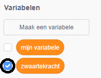

## Zwaartekracht en springen

Now you're going to make your character move more realistically: you're going to add gravity to your game and give the character the ability to jump.

\--- task \----

In the game, move your character so that it walks off a platform. Do you see that it can walk into empty space?


\--- /task \---

\--- task \----

To fix this, add gravity to your game. To do this, create a new variable called `gravity`{:class="block3variables"}.

[[[generic-scratch3-add-variable]]]

You can hide this variable from your Stage if you want to.



\--- /task \---

\--- task \---

Add these new code blocks that set `gravity` to a negative number and use the value of `gravity` to repeatedly change your character's y-coordinate:


```blocks3
    wanneer groene vlag wordt aangeklikt
maak [zwaartekracht v] [-4]
herhaal 
  verander y met (zwaartekracht)
end
```

\--- /task \---

\--- taak \---

Click the flag, and then drag your character to the top of the Stage. Wat gebeurt er? Does the gravity work as you expect?


\--- /task \---

\--- task \----

Gravity shouldn't move the character sprite through a platform or a ladder! Add an `if`{:class="block3control"} block to your code to only let the gravity work when the character is in mid-air. The gravity code should then look like this:


```blocks3
    wanneer groene vlag wordt aangeklikt
maak [zwaartekracht v] [-4]
herhaal 
  als <niet <<raak ik kleur [#003fff] ?> of <raak ik kleur [#ff00bf] ?>>> dan 
    verander y met (zwaartekracht)
  end
end
```

\--- /task \---

\--- task \----

Test the game again to see whether gravity works correctly now. Does your character sprite stop falling when it touches a platform or a ladder? Can you make the character walk off the edge of platforms and fall onto the level below?


\--- /task \---

\--- task \---

Now add code to make your character jump whenever the player presses the <kbd>space</kbd> key. One very easy way to do this is to move your character up a few times:


```blocks3
    wanneer [spatiebalk v] wordt ingedrukt
herhaal (10) keer 
  verander y met (4)
end
```

Because gravity is constantly pushing your character down by 4 pixels, you need to choose a number greater than `4` in your `change y by (4)`{:class="block3motion"} block. Change the number until you're happy with the height the character jumps.

\--- /task \---

\--- task \---

Test out your code. Notice that the jumping movement isn't very smooth. To make jumping look smoother, you need to move your character sprite by smaller and smaller amounts, until it is not rising any higher.

\--- /task \---

\--- task \----

To do this, create a new variable called `jump height`{:class="block3variables"}. Je kunt deze variabele weer verbergen als je dat wilt.

\--- /task \---

\--- task \---

Delete the jumping code you added to your character sprite, and add this code instead:


```blocks3
    wanneer [spatiebalk v] wordt ingedrukt
maak [springhoogte v] [8]
herhaal tot <(springhoogte) = [0]> 
  verander y met (springhoogte)
  verander [springhoogte v] met (-0.5)
end
```

This code moves your character up by 8 pixels, then 7.5 pixels, then 7 pixels, and so on, until it does not rise any higher. Hierdoor ziet springen er veel soepeler uit.

\--- /task \---

\--- task \----

Change the value of the `jump height`{:class="block3variables"} variable that is set before the `repeat`{:class="block3control"} starts. Then test your game.

Repeat these two steps until you're happy with how high the character jumps.

\--- /task \---