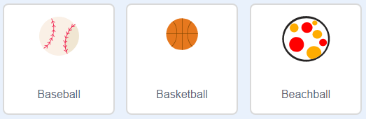

## Trefballen

Je personage kan nu bewegen en springen, dus het is tijd om ballen toe te voegen die het personage moet ontwijken.

--- task ---

Maak een nieuwe balsprite. Je kunt elke soort bal kiezen die je leuk vindt.



--- /task ---

--- task ---

Verklein de balsprite zodat het personage eroverheen kan springen. Probeer het personage over de bal te laten springen om te testen of de bal de juiste maat heeft.


--- /task ---

--- task ---

Voeg deze code toe aan je balsprite:


```blocks3
when flag clicked
hide
forever 
  wait (3) seconds
  create clone of (ikzelf v)
end
```

```blocks3
when I start as a clone
go to x: (160) y: (160)
show
repeat (22) 
  change y by (-4)
end
repeat (170) 
  change x by (-2)
  turn ccw (6) degrees
end
repeat (30) 
  change y by (-4)
end
delete this clone
```

Deze code maakt om de drie seconden een nieuwe kloon van de balsprite. Elke nieuwe kloon rolt over het bovenste platform en valt vervolgens naar beneden.

--- /task ---

--- task ---

Klik op de vlag om het spel te testen.


--- /task ---

--- task ---

Voeg meer code toe aan je balsprite, zodat klonen ervan over alle drie platforms bewegen.


--- hints ---


--- hint ---

Herhaal de codeblokken die je hebt gebruikt om de balsprite kloon over het eerste platform te bewegen. Je moet de `x`{:class="block3motion"}, `y`{:class="block3motion"}, en het aantal keren dat de `herhaal`{:class="block3control"} moet worden uitgevoerd wijzigen zodat de klonen de platforms correct volgen.

--- /hint ---

--- hint ---

Dit zijn de blokken die je nodig hebt. Zorg ervoor dat je ze in de juiste volgorde toevoegt.


```blocks3
repeat (170) 
  change x by (-2)
  turn ccw (6) degrees
end

repeat (180) 
  change x by (2)
  turn cw (6) degrees
end

repeat (30) 
  change y by (-4)
end
```

--- /hint ---

--- hint ---

De code voor jouw bal sprite klonen zou er zo moeten uitzien:


```blocks3
when I start as a clone
go to x: (160) y: (160)
show
repeat (22) 
  change y by (-4)
end
repeat (170) 
  change x by (-2)
  turn ccw (6) degrees
end
repeat (30) 
  change y by (-4)
end
repeat (180) 
  change x by (2)
  turn cw (6) degrees
end
repeat (30) 
  change y by (-4)
end
repeat (170) 
  change x by (-2)
  turn ccw (6) degrees
end
delete this clone
```

--- /hint ---

--- /hints ---

--- /task ---

--- task ---

Voeg nu een aantal codeblokken toe om een bericht te verzenden als je personage wordt geraakt door een bal!

Voeg deze code toe aan je balsprite:


```blocks3
when I start as a clone
forever 
  if <touching (Pico loopt v) ?> then 
    broadcast (raak v)
  end
end
```

--- /task ---

--- task ---

Voeg ten slotte code-blokken toe aan jouw personagesprite om terug te gaan naar de beginpositie wanneer deze de `raak` boodschap ontvangt:


```blocks3
when I receive [raak v]
point in direction (90 v)
go to x: (-210) y: (-120)
```

--- /task ---

--- task ---

Test je code. Controleer of het personage teruggaat naar de start na het aanraken van een bal.

--- /task ---