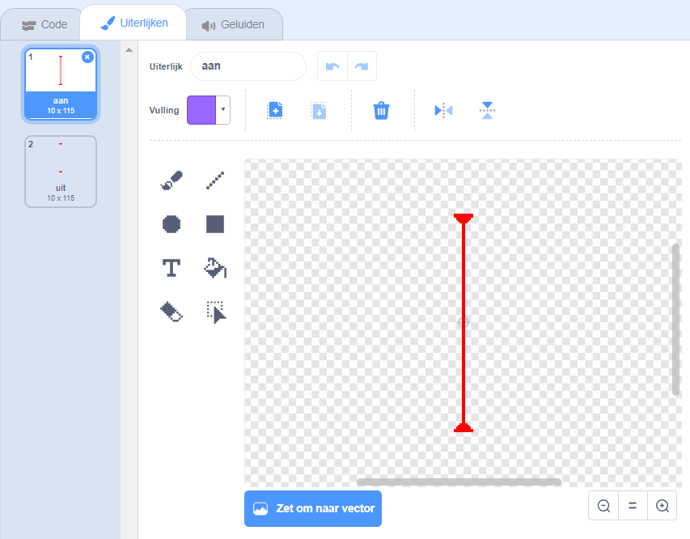

## Lasers!

Om het een beetje moeilijker te maken je spel te voltooien ga je lasers toevoegen!

\--- task \---

Voeg een nieuwe sprite toe aan je spel en noem hem `laser`. Het moet twee uiterlijken hebben die 'aan' en 'uit' heten.




\--- /task \---

\--- task \---

Zet je nieuwe laser tussen twee platforms.


\--- /task \---

\--- task \---

Voeg code aan je laser toe, zodat die kan wisselen tussen de twee uiterlijken.


```blocks3
    wanneer groene vlag wordt aangeklikt
  herhaal 
    verander uiterlijk naar (aan v)
    wacht (2) sec.
    verander uiterlijk naar (uit v)
    wacht (2) sec.
einde
```

Als je wilt, kun je de bovenstaande code wijzigen zodat de sprite `wacht`{:class="block3control"} gedurende een `willekeurig`{:class="block3operators"} bepaalde hoeveelheid tijd tussen het wisselen van uiterlijk.

\--- /task \---

\--- task \---

Voeg ten slotte code toe aan de lasersprite zodat deze een signaal 'raak' verstuurt wanneer het de personage sprite raakt.

\--- hints \---

\--- hint \---

Deze code zal erg lijken op de code die je aan je balsprite hebt toegevoegd.

\--- /hint \---

\--- hint \---

Kopieer de code van de balsprite naar deze sprite om een `zend signaal raak`{:class="block3control"} te laten sturen wanneer een `raak ik het personage `{:class="block3sensing"} plaatsvindt.

\--- /hint \---

\--- hint \---

Dit is de code die je moet toevoegen:


```blocks3
wanneer groene vlag wordt aangeklikt
herhaal 
  als <raak ik (Pico lopend v) ?>  dan 
    zend signaal (raak v)
  einde
einde
```

\--- /hint \---

\--- /hints \---

Je hoeft geen extra code toe te voegen aan je personage sprite, omdat het personage sprite al weet wat het moet doen wanneer het de `zend signaal 'raak'`{:class="block3control"} ontvangt!

\--- /task \---

\--- task \---

Test je spel om te zien of je voorbij de laser kunt komen. Als de laser te makkelijk of te moeilijk te vermijden is, verander dan de `wacht`{:class="block3control"}tijd in de code voor de laser sprite.

\--- /task \---