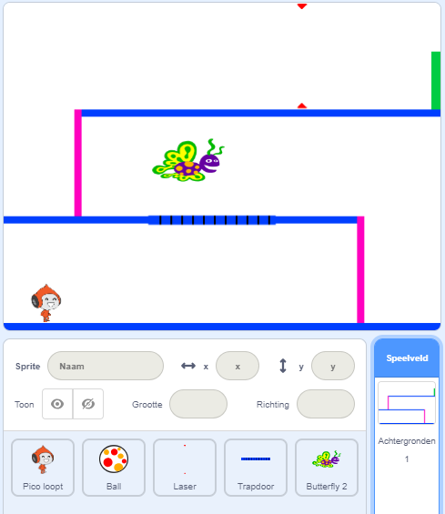

## Uitdaging: meer obstakels

Als je denkt dat je spel nog steeds te gemakkelijk is, kun je er meer obstakels aan toevoegen. De obstakels kunnen alles zijn wat je maar wilt! Hier zijn enkele ideeën:

+ Een gevaarlijke vlinder
+ Platforms die verschijnen en verdwijnen
+ Vallende tennisballen die moeten worden ontweken



Je zou zelfs een andere achtergrond kunnen ontwerpen voor het volgende niveau. Voeg vervolgens code toe zodat, wanneer je personage de groene deur bereikt, het spel overschakelt naar de nieuwe achtergrond:


```blocks3
    als <raak ik kleur [#00FF00]?> dan
        verander achtergrond naar (volgende achtergrond v)
        ga naar x: (-210) y: (-120)
        wacht (1) sec.
einde
```