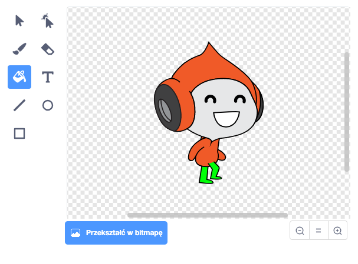

## Wyzwanie: poprawiona grawitacja

Istnieje jeden mały błąd w Twojej grze: grawitacja nie ciągnie Twojego charakteru w dół jeżeli **jakakolwiek** część duszka dotyka niebieskiej platformy. Więc nawet jeśli głowa duszka dotknie platformy, duszek nie spada! Możesz to przetestować sama: spraw, by Twoja postać wspięła się po drabinie powyżej połowy, a następnie przesuwaj ją na boki pod platformą:


Aby naprawić ten błąd, musisz najpierw dać duszkowi postaci nowe spodnie, które mają różny kolor (na **wszystkich** kostiumach).



Następnie zamień ten blok kodu:

```blocks3
    < dotyka koloru [#0000FF]? >
```

z tym blokiem kodu:

```blocks3
    < kolor [#00FF00] dotyka [#0000FF]? >
```

Aby upewnić się, że naprawiłeś błąd, przetestuj grę po wprowadzeniu tych zmian!