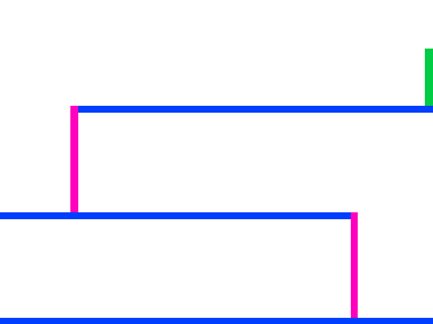
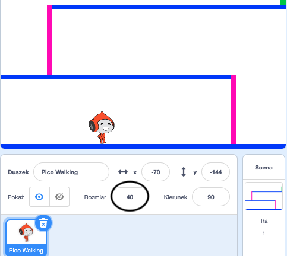
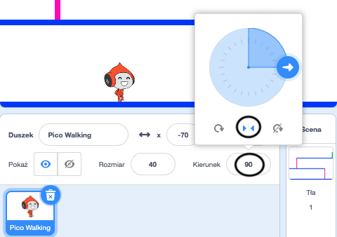

## Poruszanie się postacią

Zacznij od stworzenia postaci która może poruszać się w lewo i w prawo oraz wspinać się po drabinach.

\--- task \---

Otwórz projekt startowy Scratch „Dwa ognie”.

**Online:** otwórz nowy projekt Scratcha na stronie [rpf.io/dodgeball-on](http://rpf.io/dodgeball-on){:target="_blank"}.

Jeśli masz konto Scratch, możesz wykonać kopię klikając **Remiks**.

**Offline:** pobierz projekt początkowy z [rpf.io/p/en/dodgeball-get](http://rpf.io/p/en/dodgeball-get), i otwórz w programie Scratch Desktop.

\--- /task \---

Projekt zawiera tło z platformami:



\--- task \---

Wybierz nowego duszka jako postać, którą gracz będzie kontrolować i dodaj go do swojego projektu. Będzie najlepiej, jeśli wybierzesz duszka z wieloma kostiumami, wtedy będziesz mógł sprawić, że będzie wyglądać jakby chodził.


[[[generic-scratch3-sprite-from-library]]]

\--- /task \---

\--- task \---

Dodaj bloki kodu do duszka postaci, aby gracz mógł używać klawiszy strzałek do poruszania się postacią. Gdy gracz naciśnie prawą strzałkę, Twoja postać powinna ustawić się w prawo, poruszyć się kilka kroków i zmienić kostium na następny:


```blocks3
kiedy kliknięto zieloną flagę
zawsze
    jeżeli <klawisz (strzałka w prawo v) naciśnięty?> to         ustaw kierunek na (90 v)
        przesuń o (3) kroki
        następny kostium
    koniec
koniec
```

\--- /task \---

\--- task \---

Jeśli Twój duszek nie pasuje, dostosuj jego rozmiar.



\--- /task \---

\--- task \---

Przetestuj Twoją postać, klikając na flagę i przytrzymując klawisz prawej strzałki. Czy Twoja postać porusza się w prawo? Czy Twoja postać wygląda jakby się poruszała?


\--- /task \---

\--- task \---

Dodaj bloki kodu do pętli `zawsze`{:class="block3control"} duszka postaci, w taki sposób, żeby postać poruszała się w lewo po naciśnięciu klawisza lewej strzałki.

\--- hints \---

\--- hint \---

Aby Twoja postać mogła poruszyć się w lewo, będziesz musiała dodać kolejny blok `jeżeli`{:class="block3control"} wewnątrz pętli `zawsze`{:class="block3control"}. W tym nowym bloku `jeżeli`{:class="block3control"}, dodaj kod, aby twój duszek postaci `poruszył się`{:class="block3motion"} w lewo.

\--- /hint \---

\--- hint \---

Skopiuj utworzony kod ruchu postaci w prawo. Następnie ustaw w bloku `klawisz naciśnięty`{:class="block3sensing"} `strzałka w lewo`{:class="block3sensing"} i zmień `kierunek`{:class="block3motion"} na `-90`.

```blocks3
jeżeli <klawisz (strzałka w prawo v) naciśnięty?> to     ustaw kierunek na (-90 v)
    przesuń o (3) kroki
    następny kostium
koniec
```

\--- /hint \---

\--- hint \---

Twój kod powinien wyglądać teraz tak:


```blocks3
kiedy kliknięto zieloną flagę
zawsze 
  jeżeli <klawisz (strzałka w prawo v) naciśnięty ?> to
    ustaw kierunek na (90 v)
    przesuń o (3) kroki
    następny kostium
  koniec
  jeżeli <klawisz (strzałka w lewo) naciśnięty ?> to
    ustaw kierunek na (-90 v)
    przesuń o (3) kroki
    następny kostium
  koniec
koniec
```

\--- /hint \---

\--- /hints \---

\--- /task \---

\--- task \---

Przetestuj Twój nowy kod, by mieć pewność że działa. Czy Twoja postać obraca się do góry nogami idąc w lewo?


Jeśli tak, możesz to naprawić, klikając **Kierunek** swojego duszka postaci, a następnie klikając strzałkę lewo-prawo.



Lub jeśli wolisz, możesz również rozwiązać ten problem, dodając ten blok na początku kodu swojej postaci:

```blocks3
ustaw styl obrotu [lewo-prawo v]
```

\--- /task \---

\--- task \---

Aby wspiąć się na różową drabinę, duszek postaci powinien przesuwać się o kilka kroków w górę na scenie za każdym razem, gdy zostanie naciśnięta strzałka w górę **i** postać dotyka właściwego koloru.

Dodaj wewnątrz pętli `zawsze`{:class="block3control"} dla twojej postaci blok `zmień`{:class="block3motion"} pozycję postaci `y` (pionowa) `jeżeli`{:class="block3control"} `klawisz strzałka w górę naciśnięty`{:class="block3sensing"} i postać `dotyka kolor różowy`{:class="block3sensing"}.


```blocks3
    jeżeli <<key (up arrow v) pressed?> i <touching color [#FF69B4]?> > to
        zmień y o (4)
    end
```

\--- /task \---

\--- task \---

Przetestuj swój kod. Czy potrafisz sprawić, by postać wspinała się po różowych drabinach i dotarła do końca poziomu?


\--- /task \---