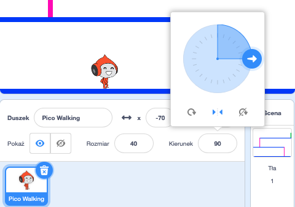

## Poruszanie się postaci

Zacznijmy tworząc postać która może poruszać się w lewo i w prawo oraz wspinać się po drabinach.

+ Otwórz projekt Scratch 'Zbijak' online <a href="http://jumpto.cc/dodge-go" target="_blank">jumpto.cc/dodge-go</a> lub pobierz z <a href="http://jumpto.cc/dodge-get" target="_blank">jumpto.cc/dodge-get</a> i otwórz jeśli używasz edytora offline.
    
    Projekt zawiera tło z platformami:
    
    

+ Dodaj nowego duszka, który będzie Twoją postacią. Będzie lepiej jeśli wybierzesz duszka z wieloma kostiumami, wtedy będziesz mógł sprawić żeby wyglądał jakby chodził.
    
    

+ Użyj klawiszy strzałek by poruszać Twoją postacią. Gdy gracz naciśnie prawą strzałkę, chcesz aby Twoja postać popatrzyła w prawo, poruszyła się kilka kroków i zmieniła kostium na następny:
    
    ```blocks
        kiedy kliknięto flagę
         zawsze
            <jeżeli klawisz [strzałka w prawo V] nacisnięty? > to
            ustaw kierunek na (90 v)
            przesuń o (3) kroków
            następny kostium
         end
        end
    ```

+ Przetestuj Twoją postać, klikając na flagę i przytrzymując klawisz prawej strzałki. Czy Twój gracz porusza się w prawo? Czy Twoja postać wygląda jakby się poruszała?
    
    

+ By poruszać Twoją postacią w lewo, będziesz potrzebował dodać inny blok `if`{:class="blockcontrol"} wewnątrz Twojej pętli `forever`{:class="blockcontrol"}, która poruszy Twoją postać w lewo.

+ Przetestuj Twój nowy kod, by mieć pewność że działa. Czy Twoja postać obraca się do góry nogami idąc w lewo?
    
    
    
    Jeśli tak, możesz naprawić to klikając ikonę `(i)`{:class="blocksensing"} na Twoim duszku, i wtedy klikając strzałka lewo-prawo.
    
    
    
    Lub, jeśli wolisz możesz dodać ten blok na start kodu Twojej postaci:
    
    ```scratch
    ustaw styl obrotu [lewo-prawo v]
    ```

+ By wspiąć się na różową drabinę, Twoja postać powinna poruszać się w górę zawsze gdy klawisz strzałka w górę jest wciśnięty i gdy dotyka ona właściwego koloru. Dodaj ten kod w środku pętli Twojej postaci `zawsze`{:class="blockcontrol"}:
    
    ```blocks
        jeżeli << klawisz [strzałka w górę] naciśnięty? > i < dotyka koloru [różowy]>
            zmień y o (4)
        end
    ```

+ Przetestuj Twoją postać - możesz wspiąć się różową drabiną i dostać się na koniec twojego poziomu?
    
    