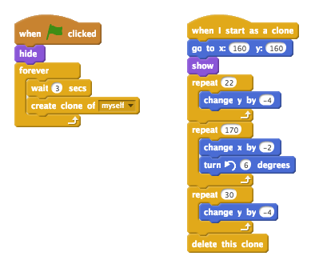

## Unikanie piłek

Teraz masz poruszającą się postać, dodajmy kilka piłek których musi unikać.

+ Utwórz nowego duszka piłkę. Możesz wybrać dowolny typ piłki który chcesz.
    
    

+ Zmień rozmiar piłki, tak by Twoja postać mogła ją przeskoczyć. By to przetestować, spróbuj przeskoczyć piłkę.
    
    

+ Dodaj ten kod do Twojej piłki:
    
    
    
    Ten kod tworzy nowy klon piłki co 3 sekundy. Każdy nowy klon porusza się wzdłuż górnej platformy.

+ Kliknij flagę by to przetestować.
    
    

+ Dodaj więcej kodu do duszków piłek, tak by te poruszały się po wszystkich trzech platformach.
    
    

+ Ostatecznie, będziesz potrzebować kodu gdy w Twoją postać zostanie trafiona piłką! Dodaj poniższy kod do duszka piłki:
    
    ```blocks
        kiedy zaczynam jako klon
            zawsze
                jeżeli < dotyka [Pico v]? > to? > to
                nadaj [trafienie v]
            end
        end
    ```

+ Będziesz również potrzebował dodać kod do Twojej postaci, aby wracała na start gdy zostanie trafiona:
    
    ```blocks
        kiedy otrzymam [trafienie v]
    ustaw kierunek na (9 0v)
    idź do x: (-210) y: (-120)
    ```

+ Przetestuj Twoją postać i zobacz czy powraca na start kiedy zostanie trafiona przez piłkę.