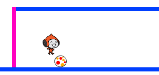
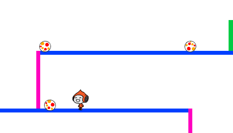
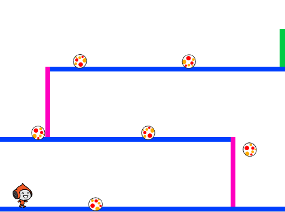

## Unikanie piłek

Twoja postać może się teraz poruszać i skakać, więc czas dodać kilka piłek, których postać musi unikać.

--- task ---

Utwórz nowego duszka piłkę. Możesz wybrać dowolny typ piłki który chcesz.


--- /task ---

--- task ---

Zmień rozmiar piłki, tak by Twoja postać mogła ją przeskoczyć. Postaraj się, aby postać przeskoczyła nad piłką, aby sprawdzić, czy piłka ma odpowiedni rozmiar.



--- /task ---

--- task ---

Dodaj poniższy kod do duszka piłki:


```blocks3
when flag clicked
hide
forever 
  wait (3) seconds
  create clone of (siebie v)
end
```

```blocks3
when I start as a clone
go to x: (160) y: (160)
show
repeat (22) 
  change y by (-4)
end
repeat (170) 
  change x by (-2)
  turn ccw (6) degrees
end
repeat (30) 
  change y by (-4)
end
delete this clone
```

Ten kod tworzy nowy klon duszka piłki co trzy sekundy. Każdy nowy klon porusza się wzdłuż górnej platformy, a następnie spada.

--- /task ---

--- task ---

Kliknij flagę, aby przetestować grę.



--- /task ---

--- task ---

Dodaj więcej kodu do swojego duszka piłki, aby jej klony poruszały się po wszystkich trzech platformach.



--- hints ---

--- hint ---

Powtórz bloki kodu, których użyłaś, aby przesuwać klon duszka piłki po pierwszej platformie. Musisz zmienić liczby `x`{:class="block3motion"}, `y`{:class="block3motion"} i `powtarzaj`{:class="block3control"} liczby, aby klony poprawnie podążały za platformami.

--- /hint ---

--- hint ---

Oto bloki, których potrzebujesz. Upewnij się, że dodałaś je we właściwej kolejności.


```blocks3
repeat (170) 
  change x by (-2)
  turn ccw (6) degrees
end

repeat (180) 
  change x by (2)
  turn cw (6) degrees
end

repeat (30) 
  change y by (-4)
end
```

--- /hint ---

--- hint ---

Kod twoich klonów duszka piłki powinien wyglądać następująco:


```blocks3
when I start as a clone
go to x: (160) y: (160)
show
repeat (22) 
  change y by (-4)
end
repeat (170) 
  change x by (-2)
  turn ccw (6) degrees
end
repeat (30) 
  change y by (-4)
end
repeat (180) 
  change x by (2)
  turn cw (6) degrees
end
repeat (30) 
  change y by (-4)
end
repeat (170) 
  change x by (-2)
  turn ccw (6) degrees
end
delete this clone
```

--- /hint ---

--- /hints ---

--- /task ---

--- task ---

Teraz dodaj kilka bloków kodu, aby nadawać (wysłać) wiadomość, jeśli twoja postać zostanie trafiona piłką!

Dodaj poniższy kod do duszka piłki:


```blocks3
when I start as a clone
forever 
  if <touching (Pico walking v) ?> then 
    broadcast (trafienie v)
  end
end
```

--- /task ---

--- task ---

Na koniec dodaj bloki kodu do duszka postaci, aby powrócił do swojej pozycji początkowej kiedy dostaje komunikat `trafienie`:


```blocks3
when I receive [trafienie v]
point in direction (90)
go to x: (-210) y: (-120)
```

--- /task ---

--- task ---

Przetestuj swój kod. Sprawdź, czy po dotknięciu piłki postać wraca na początek.

--- /task ---