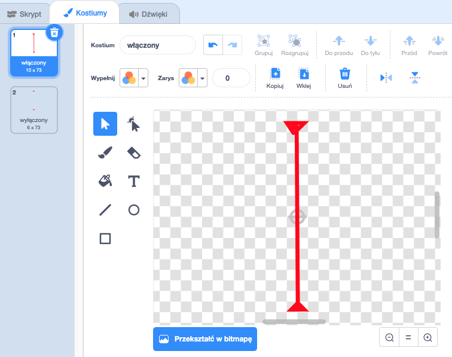

## Lasery!

Żeby zwiększyć poziom trudności Twojej gry, dodasz do niej lasery!

--- task ---

Dodaj nowego duszka do swojej gry i nazwij go `laser`. Powinien mieć dwa kostiumy, nazwane 'włączony' i 'wyłączony'.




--- /task ---

--- task ---

Umieść nowy laser pomiędzy dwoma platformami.


--- /task ---

--- task ---

Dodaj kod do lasera, by przełączał się pomiędzy dwoma kostiumami.


```blocks3
    kiedy flaga kliknięta
    zawsze
        przełącz kostium na (włączony v)
        czekaj (2) sek
        przełącz kostium na (wyłączony v)
        czekaj (2) sek
    koniec
```

Jeśli chcesz, możesz zmienić kod pokazany powyżej, aby duszek `czekał`{:class="block3control"} `losową`{:class="block3operators"} ilość czasu pomiędzy zmianami kostiumów.

--- /task ---

--- task ---

Na koniec dodaj kod do duszka lasera, aby nadawał on komunikat „trafiony”, gdy dotknie duszka postaci.

--- hints ---


--- hint ---

Ten kod powinien być bardzo podobny do kodu który dodałeś do duszka piłki.

--- /hint ---

--- hint ---

Skopiuj kod poprzednio dodany do duszka piłki, aby ten duszek lasera `nadawał 'trafiony'`{:class="block3control"}, kiedy `dotyka Twojej postaci`{:class="block3sensing"}.

--- /hint ---

--- hint ---

Oto kod, który powinnaś dodać:


```blocks3
kiedy flaga kliknięta
zawsze 
  jeżeli <touching (Pico walking v) ?> to 
    nadaj komunikat (trafiony v)
  koniec
koniec
```

--- /hint ---

--- /hints ---

Nie musisz dodawać żadnego dodatkowego kodu do Twojego duszka postaci, ponieważ duszek postaci już wie co zrobić, gdy otrzyma `komunikat 'trafiony'`{:class="block3control"}!

--- /task ---

--- task ---

Przetestuj grę by zobaczyć czy potrafisz przejść postacią przez laser. Jeśli laser jest zbyt łatwy lub zbyt trudny do uniknięcia, zmień wartości `czekania`{:class="block3control"} w kodzie dla duszka lasera.

--- /task ---