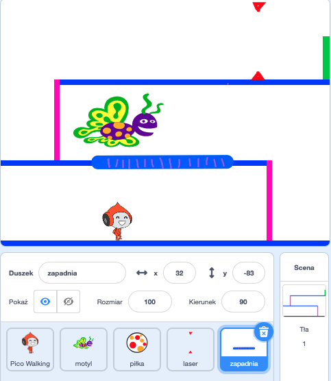

## Wyzwanie: więcej przeszkód

Jeżeli myślisz że Twoja gra wciąż jest zbyt łatwa, możesz do niej dodać więcej przeszkód. Przeszkody mogą być czymkolwiek zechcesz! Oto kilka pomysłów:

+ Groźny motyl
+ Platformy które pojawiając się i znikają
+ Spadające piłeczki tenisowe których musisz unikać



Możesz nawet zaprojektować kolejne tło, aby stworzyć kolejny poziom. Następnie dodaj kod, aby gdy Twoja postać dotrze do zielonych drzwi, gra przełączyła się na nowe tło:


```blocks3
if <touching color [#00FF00] ?> then 
  switch backdrop to (następne tło v)
  go to x: (-210) y: (-120)
  wait (1) seconds
end
```