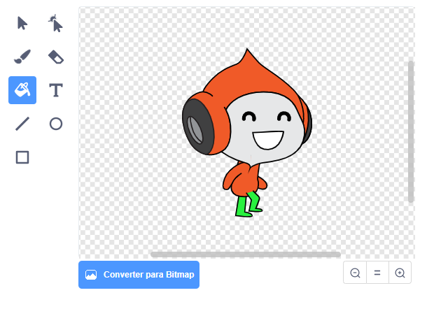

## Desafio: gravidade melhorada

Há um outro pequeno problema em seu jogo: a gravidade não puxa o ator personagem para baixo se **qualquer** parte do ator estiver tocando uma plataforma azul. Então, mesmo que a cabeça do ator toque em uma plataforma, o ator não cai! Você mesmo pode testar isto: faça seu personagem subir a maior parte da escada e, em seguida, mova o personagem para o lado abaixo de uma plataforma:


Para corrigir o erro, primeiro você precisa dar ao seu ator personagem novas calças que tenham uma cor diferente (em **todas** fantasias).



Em seguida, substitua este bloco de código:

```blocks3
    < touching color [#0000FF]? >
```

por este bloco de código:

```blocks3
    < color [#00FF00] is touching [#0000FF]? >
```

Para se certificar de ter consertado o problema, teste o jogo depois que tiver feito essas mudanças!