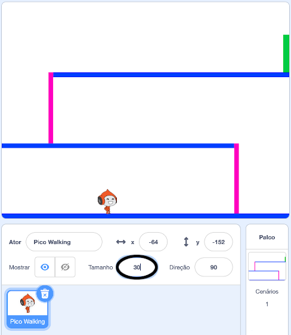
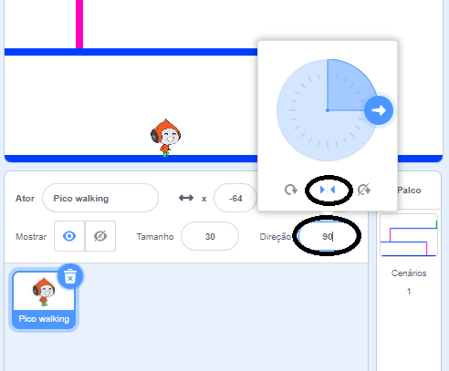

## Movimento do personagem

Vamos começar criando um personagem que pode se mover para esquerda e direita, e também subir escadas.

--- task ---

Abra o projeto inicial 'Queimada' do Scratch.

**Online:** abra o projeto inicial em [rpf.io/dodgeball-on](http://rpf.io/dodgeball-on){:target="_blank"}.

Se você tiver uma conta do Scratch, pode fazer uma cópia clicando em **Remix**.

**Offline:** baixe o projeto inicial em [rpf.io/p/pt-BR/dodgeball-get](http://rpf.io/p/pt-BR/dodgeball-get) e, em seguida, abra-o usando o editor offline.

--- /task ---

O projeto contém um plano de fundo com plataformas:


--- task ---

Escolha um novo ator como o personagem que o jogador irá controlar, e adicione-o ao seu projeto. É melhor escolher um ator com várias fantasias, para que você possa fazer parecer que está andando.


[[[generic-scratch3-sprite-from-library]]]

--- /task ---

--- task ---

Adicione blocos de código ao seu ator personagem para que o jogador possa usar as setas para mover o personagem. Quando o jogador pressiona a seta para a direita, o personagem deve apontar para a direita, mover alguns passos e mudar para a próxima fantasia:


```blocks3
when flag clicked
forever
	if <key (right arrow v) pressed? > then
		point in direction (90 v)
		move (3) steps
		next costume
	end
end
```

--- /task ---

--- task ---

Se o seu ator não couber, ajuste o tamanho.



--- /task ---

--- task ---

Teste seu personagem clicando na bandeira e, em seguida, mantenha pressionada a seta para a direita no teclado. Seu personagem se move para a direita? Seu personagem parece estar andando?


--- /task ---

--- task ---

Adicione blocos de código ao laço `sempre`{:class="block3control"} do ator personagem para que ele ande para a esquerda se a tecla seta para esquerda for pressionada.

--- hints ---


--- hint ---

Para que seu personagem possa se mover para a esquerda, você precisará adicionar outro bloco `se`{:class="block3control"} dentro do laço `sempre`{:class="block3control"}. Neste novo bloco `se`{:class="block3control"}, adicione código para fazer seu ator personagem `mova`{:class="block3motion"} para a esquerda.

--- /hint ---

--- hint ---

Copie o código que você criou para fazer o personagem andar para a direita. Em seguida, ajuste a `tecla pressionada`{:class="block3sensing"} para `seta para esquerda`{:class="block3sensing"} e mude a `direção`{:class="block3motion"} para `-90`.

```blocks3
if <key (right arrow v) pressed? > then
	point in direction (90 v)
	move (3) steps
	next costume
end
```

--- /hint ---

--- hint ---

Seu código deve ficar assim:


```blocks3
when green flag clicked
forever 
  if <key (right arrow v) pressed?> then 
    point in direction (90 v)
    move (3) steps
    next costume
  end
  if <key (left arrow v) pressed?> then 
    point in direction (-90 v)
    move (3) steps
    next costume
  end
end
```

--- /hint ---

--- /hints ---

--- /task ---

--- task ---

Teste seu novo código para ter certeza de que funciona. Seu personagem vira de cabeça para baixo quando caminha para a esquerda?


Em caso afirmativo, você pode corrigir isso clicando na **direção** do ator personagem e, em seguida, clicando na seta esquerda-direita.



Ou, se preferir, também é possível corrigir o problema adicionando este bloco ao início do script do seu personagem:

```blocks3
set rotation style [left-right v]
```

--- /task ---

--- task ---

Para escalar uma escada rosa, seu ator personagem deve mover alguns passos para cima no Palco sempre que a seta para cima for pressionada **e** o personagem estiver tocando a cor correta.

Adicione dentro do laço `sempre`{:class="block3control"} do seu personagem para `adicione a y`{:class="block3motion"} a posição `y` (vertical) do personagem `se`{:class="block3control"} a `seta para cima está pressionada`{:class="block3sensing"} e o personagem está `tocando na cor rosa`{:class="block3sensing"}.


```blocks3
    if < <key (up arrow v) pressed?> and <touching color [#FF69B4]?> > then
		change y by (4)
	end
```

--- /task ---

--- task ---

Teste seu código. Você consegue fazer o personagem subir as escadas cor-de-rosa e chegar ao final do nível?


--- /task ---