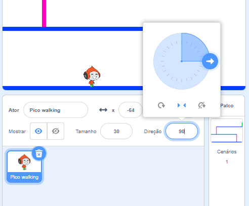

## Movimento do personagem

Vamos começar criando um personagem que pode se mover para esquerda e direita, e também subir escadas.

+ Abra o projeto 'Dodgeball' Scratch online em<a href="http://jumpto.cc/dodge-go" target="_blank">jumpto.cc/dodge-go</a> ou baixe em <a href="http://jumpto.cc/dodge-get" target="_blank">jumpto.cc/dodge-get</a> então abra se você estiver usando o editor offline.
    
    O projeto contém um plano de fundo com plataformas:
    
    

+ Adicione um novo espírito, que será o seu personagem. É melhor se você escolher um espírito com várias fantasias, para que você possa fazer parecer que está andando.
    
    

+ Vamos usar as setas do teclado para mover seu personagem. Quando o jogador pressiona a seta para a direita, você quer que seu personagem aponte para a direita, mova alguns passos e mude para a próxima roupa:
    
    ```blocks
        when flag clicked
        forever
            if <key [right arrow v] pressed? > then
                point in direction (90 v)
                move (3) steps
                next costume
            end
        end
    ```

+ Teste seu personagem clicando no sinalizador e, em seguida, mantendo pressionada a tecla de seta para a direita. O seu jogador se move para a direita? Does your character look like they are walking?
    
    

+ Para mover seu personagem para esquerda, você vai precisar adicionar outro`if`{:class="blockcontrol"} bloqueie dentro seu `forever`{:class="blockcontrol"} laço, que move o seu personagem para a esquerda.

+ Teste seu novo código para ter certeza de que funciona. Seu personagem vira de cabeça para baixo quando caminha para a esquerda?
    
    
    
    Se virar, você pode consertar esse erro clicando em `(i)`{:class="blocksensing" ícone no espírito do seu personagem e, em seguida, clicando na seta esquerda-direita.
    
    
    
    Ou, se preferir, você pode adicionar este bloco ao início do script do seu personagem:
    
    ```scratch
    set rotation style [left-right v]
    ```

+ Para subir uma escada cor-de-rosa, seu personagem deve subir levemente sempre que a seta para cima estiver pressionada e eles estiverem tocando a cor correta. Adicione este código no seu personagem `forever`{:class="blockcontrol"} loop:
    
    ```blocks
        if < <key [up arrow v] pressed?> and <touching color [#FF69B4]?> > then
            change y by (4)
        end
    ```

+ Teste seu personagem - você pode subir nas escadas cor-de-rosa e chegar ao final do seu nível?
    
    