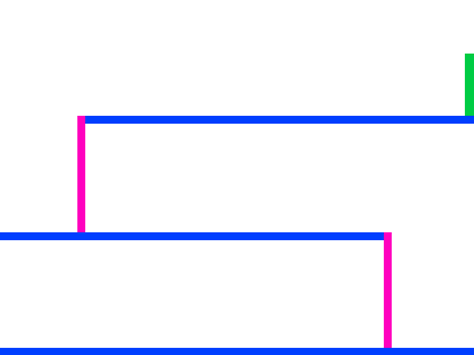

## Movimento do personagem

Vamos começar criando um personagem que pode se mover para esquerda e direita, e também subir escadas.

\--- task \---

Abra o projeto inicial 'Dodgeball' Scratch.

** Online: ** abra o projeto inicial em [ rpf.io/dodgeball-on ](http://rpf.io/dodgeball-on) {: target = "_ blank"}.

Se você tiver uma conta do Scratch, pode fazer uma cópia clicando em ** Remix **.

**Off-line:** Baixe o projeto inicial em [rpf.io/p/en/dodgeball-get](http://rpf.io/p/en/dodgeball-get) e, em seguida, abra-o usando o editor Scratch Offline.

\--- /task \---

O projeto contém um plano de fundo com plataformas:



\--- task \---

Escolha um novo sprite com o personagem que o jogador irá controlar, e adicione-o ao seu projeto. É melhor escolher um sprite com vários trajes, para que você pareça estar andando.


[[[generic-scratch3-sprite-from-library]]]

\--- /task \---

\--- task \---

Adicione blocos de código ao seu personagem sprite para que o jogador possa usar as setas para mover o personagem. Quando o jogador pressiona a seta para a direita, você quer que seu personagem aponte para a direita, mova alguns passos e mude para a próxima roupa:


```blocks3
when flag clicked
forever
    if <key (right arrow v) pressed? > then
        point in direction (90 v)
        move (3) steps
        next costume
    end
end
```

\--- /task \---

\--- task \---

Se o seu sprite não couber, ajuste o tamanho.


\--- /task \---

\--- task \---

Teste seu personagem clicando no sinalizador e, em seguida, mantendo pressionada a tecla de seta para a direita. Seu personagem se move para a direita? Seu personagem parece estar andando?


\--- /task \---

\--- task \---

Adicione blocos de código ao sprite `forever`{:class="loop block3control"} para que ele passe para a esquerda se a tecla de seta à esquerda for pressionada.

\--- hints \---

\--- hint \---

Para que seu personagem possa se mover para a esquerda, você precisará adicionar outro `if` {: class = "block3control"} dentro do loop `forever` {: class = "block3control"}. Neste novo `if` {: class = "block3control"}, adicione código para fazer seu sprite `move` {: class = "block3motion"} para a esquerda.

\--- /hint \---

\--- hint \---

Copie o código que você criou para fazer o personagem andar para a direita. Em seguida, ajuste a tecla `pressionada` {: class = "block3sensing"} na `left arrow` {: class = "block3sensing"} e altere a `direction` {: class = "block3motion"} para `-90`.

```blocks3
if <key (right arrow v) pressed? > then
    point in direction (90 v)
    move (3) steps
    next costume
end
```

\--- /hint \---

\--- hint \---

Seu código deve ficar assim:


```blocks3
when green flag clicked
forever 
  if <key (right arrow v) pressed?> then 
    point in direction (90 v)
    move (3) steps
    next costume
  end
  if <key (left arrow v) pressed?> then 
    point in direction (-90 v)
    move (3) steps
    next costume
  end
end
```

\--- /hint \---

\--- /hints \---

\--- /task \---

\--- task \---

Teste seu novo código para ter certeza de que funciona. Seu personagem vira de cabeça para baixo quando caminha para a esquerda?


Se assim for, você pode corrigir isso clicando no **direção** do seu sprite do personagem e depois clicando na seta esquerda-direita.


Ou, se preferir, também é possível corrigir o problema adicionando este bloco ao início do script do seu personagem:

```blocks3
definir estilo de rotação [esquerda-direita v]
```

\--- /task \---

\--- task \---

Para escalar uma escada rosa, seu personagem sprite deve mover alguns passos para cima na fase sempre que a seta para cima for pressionada **e** o personagem estiver tocando a cor correta.

Adicione dentro do seu personagem `forever`{:class="block3control"} para `alterar`{:class="block3motion"} a posição `y` (vertical) do personagem `se`{:class="block3control"} a `seta para cima está pressa`{:class="block3sensing"} e o personagem está `tocando a cor `{:class="block3sensing"}.


```blocks3
    if < <key (up arrow v) pressed?> and <touching color [#FF69B4]?> > then
        change y by (4)
    end
```

\--- /task \---

\--- task \---

Teste seu código. Teste seu personagem - você pode subir nas escadas cor-de-rosa e chegar ao final do seu nível?


\--- /task \---