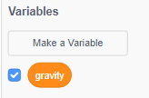
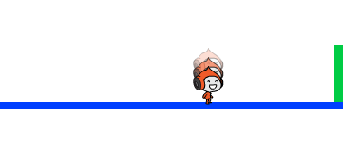

## Gravidade e Salto

Vamos fazer seu personagem se mover de forma mais realista, adicionando gravidade e permitindo que eles pulem.

+ Você deve ter notado que seu personagem pode sair de uma plataforma no ar. Tente sair de uma plataforma e veja o que acontece.
    
    

+ Para consertar isso, vamos adicionar gravidade ao seu jogo. Criar uma nova variável chamada `gravity`{:="blockdata"}. Você pode ocultar essa variável do seu palco, se quiser.
    
    

+ Adicione este novo bloco de código, que define a gravidade para um número negativo e, em seguida, usa isso para alterar repetidamente a coordenada y do seu personagem.
    
    ```blocks
        when flag clicked
        set [gravity v] to [-4]
        forever
            change y by (gravity)
        end
    ```

+ Clique na bandeira e arraste seu personagem para o topo do palco. O que acontece? Does the gravity work as you expected?
    
    

+ Gravidade não deve mover seu personagem através de uma plataforma ou uma escada! Adicione um bloco `if </ 0> {: class = "blockcontrol"} ao seu código, para que a gravidade só funcione quando seu personagem estiver no ar. O código de gravidade agora deve ficar assim:</p>

<pre><code class="blocks">    when flag clicked
    set [gravity v] to [-4]
    forever
        if < not < <touching color [#0000FF]?> or <touching color [#FF69B4]?> > > then
            change y by (gravity)
        end
    end
`</pre></li> 
    
    + Teste a gravidade novamente. Seu personagem pára quando está em uma plataforma ou em uma escada? Você pode andar fora da borda das plataformas para o nível abaixo?
        
        
    
    + Vamos também fazer seu personagem pular quando o jogador pressionar a barra de espaço. One very easy way to do this is to move your character up a few times, using this code:
        
        ```blocks
            when [space v] key pressed
            repeat (10)
                change y by (4)
            end
        ```
        
        Como a gravidade está constantemente empurrando seu personagem para baixo por 4 pixels, você precisa escolher um número maior que 4 em seu bloco ` y (4) </ 0> {: class = "blockmotion"}. Altere este número até ficar satisfeito com a altura que o seu personagem salta.</p></li>
<li><p>Se você testar esse código, perceberá que ele funciona, mas o movimento não é muito suave. Para fazer com que o pulo pareça mais suave, você precisará mover seu personagem em quantidades cada vez menores, até que ele não esteja pulando mais.</p></li>
<li><p>Para fazer isso, crie outra variável chamada <code> altura do salto </ 0> {: class = "blockdata"}. Mais uma vez, você pode ocultar essa variável, se preferir.</p></li>
<li><p>Delete the jumping code you added to your character, and replace it with this code:</p>

<pre><code class="blocks">    when [space v] key pressed
    set [jump height v] to [8]
    repeat until < (jump height) = [0] >
        change y by (jump height)
        change [jump height v] by (-0.5)
    end
`</pre> 
        
        This code moves your character up by 8 pixels, then 7.5 pixels, then 7 pixels, and so on, until your character has finished jumping. Isso faz com que o salto pareça muito mais suave.</li> 
        
        + Altere o valor inicial de sua variável  altura do salto </ 0> {: class = "blockdata"} e teste-a até ficar satisfeito com a altura que o seu personagem salta.</p></li>
</ul>