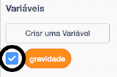

## Gravidade e salto

Agora você fará seu personagem se mover de maneira mais realista: você adicionará gravidade ao seu jogo e dará ao personagem a capacidade de pular.

\--- task \---

No jogo, mova seu personagem para que ele saia de uma plataforma. Você vê que ele pode caminhar para um espaço vazio?


\--- /task \---

\--- task \---

Para corrigir isso, adicione gravidade ao seu jogo. Para fazer isso, crie uma nova variável chamada `gravity`{:class="block3variables"}.

[[[generic-scratch3-add-variable]]]

Você pode esconder esta variável no seu estágio se quiser.



\--- /task \---

\--- task \---

Adicione esses novos blocos de código que definem `gravity` para um número negativo e use o valor de `gravity` para mudar repetidamente a coordenada y do seu personagem:


```blocks3
    when flag clicked
    set [gravity v] to [-4]
    forever
        change y by (gravity)
    end
```

\--- /task \---

\--- task \---

Clique na bandeira, e então arraste seu personagem para o topo do Estágio. O que acontece? A gravidade funciona como você espera?


\--- /task \---

\--- task \---

Gravidade não deve mover seu personagem através de uma plataforma ou uma escada! Adicione um bloco `if` {: class = "blockcontrol"} ao seu código, para que a gravidade só funcione quando seu personagem estiver no ar. O código de gravidade agora deve ficar assim:


```blocks3
    when flag clicked
    set [gravity v] to [-4]
    forever
        if < not < <touching color [#0000FF]?> or <touching color [#FF69B4]?> > > then
            change y by (gravity)
        end
    end
```

\--- /task \---

\--- task \---

Teste o jogo novamente para ver se a gravidade funciona corretamente agora. O seu personagem para de cair quando toca uma plataforma ou uma escada? Você pode fazer o personagem sair da borda das plataformas e cair no nível abaixo?


\--- /task \---

\--- task \---

Agora adicione um código para fazer seu personagem pular sempre que o jogador pressionar a tecla <kbd>espaço</kbd>. Uma maneira muito fácil de fazer isso é mover seu personagem algumas vezes:


```blocks3
    when [space v] key pressed
    repeat (10)
        change y by (4)
    end
```

Como a gravidade está constantemente empurrando seu personagem para baixo por 4 pixels, você precisa escolher um número maior que `4` em seu bloco `change y by (4)`{: class="blockmotion"}. Altere este número até ficar satisfeito com a altura que o seu personagem salta.

\--- /task \---

\--- task \---

Teste seu código. Observe que o movimento saltando não é muito fácil. Para fazer o salto parecer mais suave, você precisa mover o personagem em quantidades cada vez menores, até que ele não suba mais.

\--- /task \---

\--- task \---

Para fazer isso, crie uma nova variável chamada `gravity`{:class="block3variables"}. Mais uma vez, você pode ocultar essa variável, se preferir.

\--- /task \---

\--- task \---

Exclua o código de salto que você adicionou ao seu sprite de personagem e adicione este código:


```blocks3
    when [space v] key pressed
    set [jump height v] to [8]
    repeat until < (jump height) = [0] >
        change y by (jump height)
        change [jump height v] by (-0.5)
    end
```

Esse código move seu personagem para cima em 8 pixels, 7,5 pixels, 7 pixels e assim por diante, até que não suba mais. Isso faz com que o salto pareça muito mais suave.

\--- /task \---

\--- task \---

Alterar o valor da variável `saltar`{:class="block3variables"} que é definida antes da variável `repetir`{:class="block3control"} começar. Então teste seu jogo.

Altere este número até ficar satisfeito com a altura que o seu personagem salta.

\--- /task \---