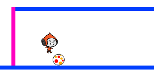

## Esquivando das bolas

Seu personagem pode se mover e pular agora, então é hora de adicionar algumas bolas que o personagem tem que evitar.

\--- task \---

Crie um novo sprite. Você pode escolher qualquer tipo de bola que quiser.


\--- /task \---

\--- task \---

Redimensionar o sprite de bola para que o personagem possa pular sobre ele. Tente fazer o personagem pular sobre a bola para testar se a bola é do tamanho certo.



\--- /task \---

\--- task \---

Adicione este código ao seu sprite:


```blocks3
when green flag clicked
hide
forever 
  wait (3) seconds
  create clone of (myself v)
end
```

```blocks3
when I start as a clone
go to x: (160) y: (160)
show
repeat (22) 
  change y by (-4)
end
repeat (170) 
  change x by (-2)
  turn ccw (6) degrees
end
repeat (30) 
  change y by (-4)
end
delete this clone
```

Este código cria um novo clone da bola a cada três segundos. Cada novo clone se move ao longo da plataforma superior e então cai.

\--- /task \---

\--- task \---

Clique na bandeira para testar o jogo.


\--- /task \---

\--- task \---

Adicione mais códigos ao seu sprite para que os clones se movam entre as três plataformas.


\--- hints \---

\--- hint \---

Repita os blocos de código que você usou para mover o clone do sprite através da primeira plataforma. Você precisa alterar o `x`{:class="block3motion"}, `y`{:class="block3motion"}, e `repetir`{:class="block3control"} números para que os clones sigam as plataformas corretamente.

\--- /hint \---

\--- hint \---

Estes são os blocos que você precisa. Certifique-se de adicioná-los na ordem correta.


```blocks3
repeat (170) 
  change x by (-2)
  turn ccw (6) degrees
end

repeat (180) 
  change x by (2)
  turn cw (6) degrees
end

repeat (30) 
  change y by (-4)
end
```

\--- /hint \---

\--- hint \---

O código para o seu sprite de bola clonado deve se parecer com isso:


```blocks3
when I start as a clone
go to x: (160) y: (160)
show
repeat (22) 
  change y by (-4)
end
repeat (170) 
  change x by (-2)
  turn ccw (6) degrees
end
repeat (30) 
  change y by (-4)
end
repeat (180) 
  change x by (2)
  turn cw (6) degrees
end
repeat (30) 
  change y by (-4)
end
repeat (170) 
  change x by (-2)
  turn ccw (6) degrees
end
delete this clone
```

\--- /hint \---

\--- /hints \---

\--- /task \---

\--- task \---

Agora adicione alguns blocos de código para transmitir (enviar) uma mensagem se seu personagem for atingido por uma bola!

Adicione este código ao seu sprite:


```blocks3
    when I start as a clone
    forever
        if < touching (Pico walking v)? > then
            broadcast (hit v)
        end
    end
```

\--- /task \---

\--- task \---

Finalmente, adicione blocos de código ao seu personagem sprite para torná-lo de volta à sua posição inicial quando receber a mensagem `hit`:


```blocks3
    when I receive [hit v]
    point in direction (90)
    go to x: (-210) y: (-120)
```

\--- /task \---

\--- task \---

Teste seu código. Verifique se o personagem volta ao início depois de tocar uma bola.

\--- /task \---